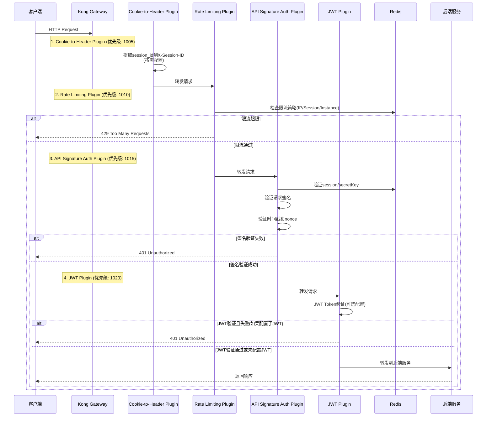

```mermaid
sequenceDiagram
    participant Client as 客户端
    participant Kong as Kong Gateway
    participant C2H as Cookie-to-Header Plugin
    participant RL as Rate Limiting Plugin
    participant SIG as API Signature Auth Plugin
    participant JWT as JWT Plugin
    participant Redis as Redis
    participant Backend as 后端服务

    Client->>Kong: HTTP Request
    Note over Kong: 1. Cookie-to-Header Plugin (优先级: 1005)
    C2H->>C2H: 提取session_id到X-Session-ID<br/>(按需配置)
    C2H->>RL: 转发请求

    Note over Kong: 2. Rate Limiting Plugin (优先级: 1010)
    RL->>Redis: 检查限流策略(IP/Session/Instance)
    alt 限流超限
        RL-->>Client: 429 Too Many Requests
    else 限流通过
        Note over Kong: 3. API Signature Auth Plugin (优先级: 1015)
        RL->>SIG: 转发请求
        SIG->>Redis: 验证session/secretKey
        SIG->>SIG: 验证请求签名
        SIG->>SIG: 验证时间戳和nonce

        alt 签名验证失败
            SIG-->>Client: 401 Unauthorized
        else 签名验证成功
            Note over Kong: 4. JWT Plugin (优先级: 1020)
            SIG->>JWT: 转发请求
            JWT->>JWT: JWT Token验证(可选配置)

            alt JWT验证且失败(如果配置了JWT)
                JWT-->>Client: 401 Unauthorized
            else JWT验证通过或未配置JWT
                JWT->>Backend: 转发到后端服务
                Backend-->>Client: 返回响应
            end
        end
    end
```