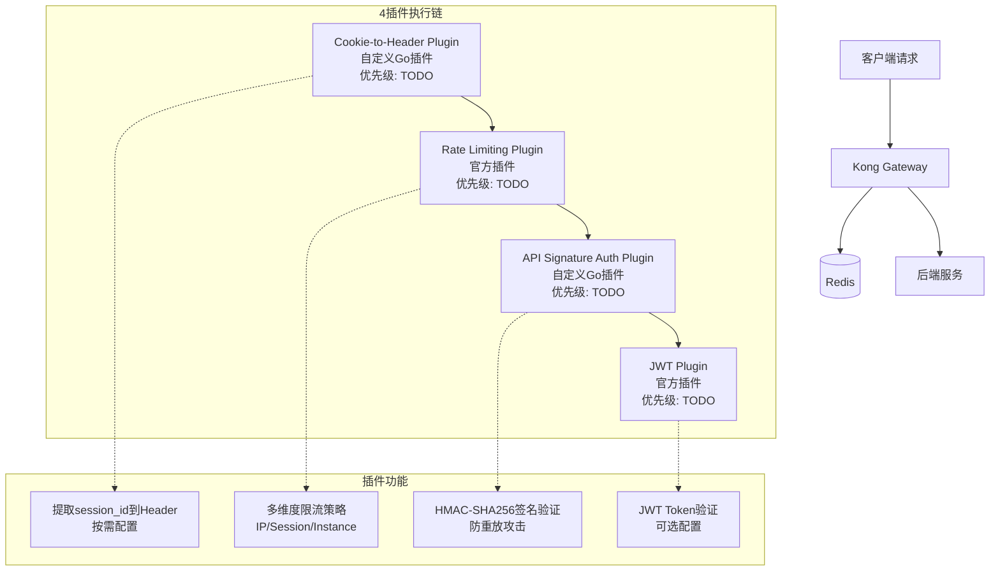

```mermaid
graph TB
    Client[客户端请求] --> Kong[Kong Gateway]

    subgraph "4插件执行链"
        A[Cookie-to-Header Plugin<br/>自定义Go插件<br/>优先级: TODO] --> B[Rate Limiting Plugin<br/>官方插件<br/>优先级: TODO]
        B --> C[API Signature Auth Plugin<br/>自定义Go插件<br/>优先级: TODO]
        C --> D[JWT Plugin<br/>官方插件<br/>优先级: TODO]
    end

    Kong --> Redis[(Redis)]
    Kong --> Backend[后端服务]

    subgraph "插件功能"
        A1[提取session_id到Header<br/>按需配置]
        B1[多维度限流策略<br/>IP/Session/Instance]
        C1[HMAC-SHA256签名验证<br/>防重放攻击]
        D1[JWT Token验证<br/>可选配置]
    end

    A -.-> A1
    B -.-> B1
    C -.-> C1
    D -.-> D1
```