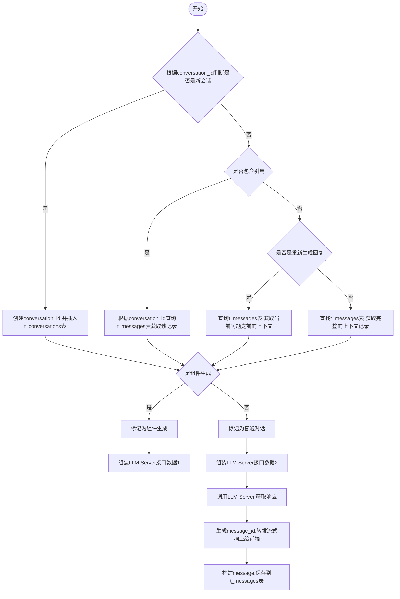

```mermaid
flowchart TD
    A([开始]) --> B{根据conversation_id判断是否是新会话}
    B -- 是 --> C[创建conversation_id,并插入t_conversations表]
    B -- 否 --> D{是否包含引用}
    D -- 是 --> E[根据conversation_id查询t_messages表获取该记录]
    D -- 否 --> F{是否是重新生成回复}
    F -- 是 --> G[查询t_messages表,获取当前问题之前的上下文]
    F -- 否 --> H[查找t_messages表,获取完整的上下文记录]
     
    C & E & G & H --> I{是组件生成}
    I -- 是 --> J[标记为组件生成]
    I -- 否 --> K[标记为普通对话]

    J --> L[组装LLM Server接口数据1]    
    K --> M[组装LLM Server接口数据2]    
    M --> N[调用LLM Server,获取响应]    
    N --> O[生成message_id,转发流式响应给前端]
    O --> P[构建message,保存到t_messages表]

```