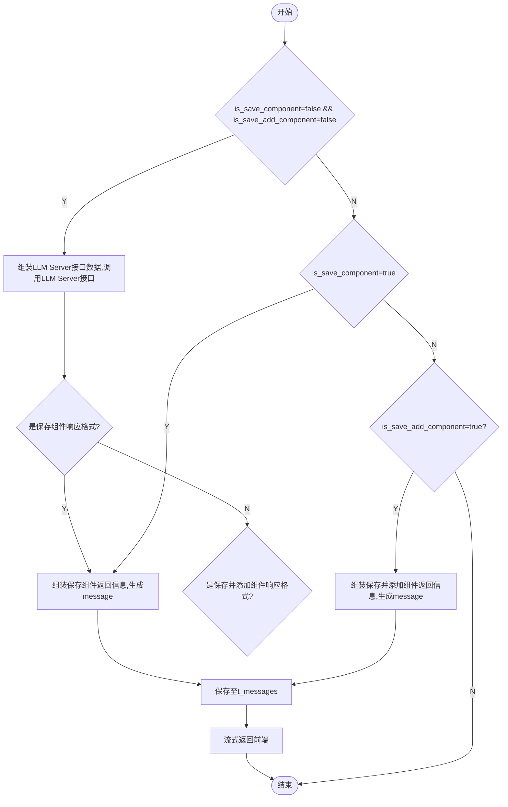

```mermaid
flowchart TD
    A([开始]) --> B{is_save_component=false && is_save_add_component=false}
    B -- Y --> C[组装LLM Server接口数据,调用LLM Server接口]
    B -- N --> D{is_save_component=true}
    C --> E{是保存组件响应格式?}
    E -- Y --> F[组装保存组件返回信息,生成message]
    E -- N --> L{是保存并添加组件响应格式?}
    
    F --> G[保存至t_messages]
    G --> H[流式返回前端]
    H --> I([结束])
    D -- Y --> F
    D -- N --> J{is_save_add_component=true?}
    J -- Y --> K[组装保存并添加组件返回信息,生成message]
    K --> G
    J -- N --> I

```