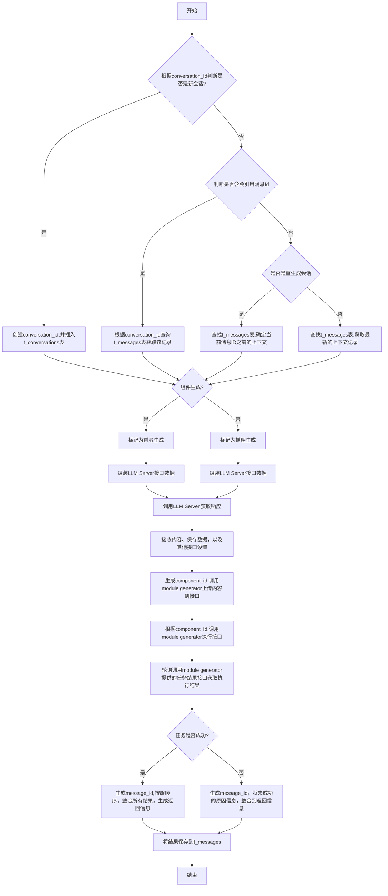

```mermaid
flowchart TD
    A[开始] --> B{根据conversation_id判断是否是新会话?}
    B -- 是 --> C[创建conversation_id,并插入t_conversations表]
    B -- 否 --> D{判断是否含会引用消息Id}
    D -- 是 --> E[根据conversation_id查询t_messages表获取该记录]
    D -- 否 --> F{是否是重生成会话}
    F -- 是 --> G[查找t_messages表,确定当前消息ID之前的上下文]
    F -- 否 --> H[查找t_messages表,获取最新的上下文记录]

    C & E & G & H --> I{组件生成?}
    I -- 是 --> J[标记为前者生成]
    I -- 否 --> K[标记为推理生成]

    J --> L[组装LLM Server接口数据]
    K --> M[组装LLM Server接口数据]
    L & M --> N[调用LLM Server,获取响应]
    N --> O[接收内容、保存数据，以及其他接口设置]

    O --> P[生成component_id,调用module generator上传内容到接口]
    P --> Q[根据component_id,调用module generator执行接口]
    Q --> R[轮询调用module generator提供的任务结果接口获取执行结果]

    R --> S{任务是否成功?}
    S -- 是 --> T[生成message_id,按照顺序，整合所有结果，生成返回信息]
    S -- 否 --> U[生成message_id，将未成功的原因信息，整合到返回信息]

    T & U --> V[将结果保存到t_messages]
    V --> W[结束]

```