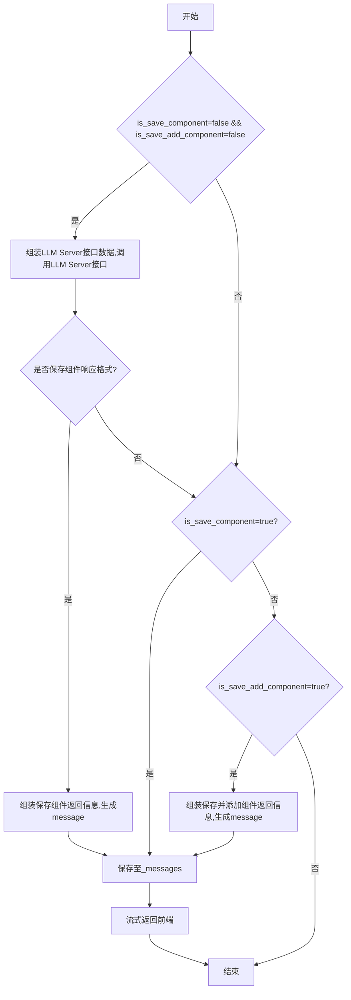

```mermaid
flowchart TD
    A[开始] --> B{is_save_component=false && is_save_add_component=false}
    B -- 是 --> C[组装LLM Server接口数据,调用LLM Server接口]
    B -- 否 --> D{is_save_component=true?}
    C --> E{是否保存组件响应格式?}
    E -- 是 --> F[组装保存组件返回信息,生成message]
    E -- 否 --> D
    F --> G[保存至_messages]
    G --> H[流式返回前端]
    H --> I[结束]
    D -- 是 --> G
    D -- 否 --> J{is_save_add_component=true?}
    J -- 是 --> K[组装保存并添加组件返回信息,生成message]
    K --> G
    J -- 否 --> I

```