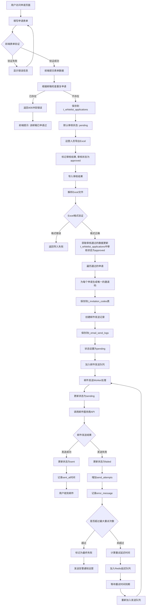

```mermaid
flowchart TD
    A[用户访问申请页面] --> B[填写申请表单]
    B --> C{前端表单验证}
    C -->|验证失败| D[显示错误信息]
    D --> B
    C -->|验证成功| E[前端提交表单数据]
    E --> F[根据邮箱检查重复申请]
    F -->|已存在| G[返回409冲突错误]
    G --> H[前端提示: 该邮箱已申请过]
    F -->|不存在| I[保存到t_whitelist_applications]
    I --> K[默认审核状态: pending]
    
    K --> P[运营人员导出Excel]
    P --> S[标记审核结果, 审核状态为approved]
    S --> T[导入审核结果]
    T --> T2[解析Excel文件]
    T2 --> T3{Excel格式验证}
    T3 -->|格式错误| T4[返回导入失败]
    T3 -->|格式正确| U[获取审核通过的数据更新t_whitelist_applications中审核状态为approved]
    U --> W[遍历通过的申请]
    W --> X[为每个申请生成唯一的邀请码]
    X --> X2[保存到t_invitation_codes表]
    X2 --> Z2[创建邮件发送记录]
    Z2 --> Z3[保存到t_email_send_logs]
    Z3 --> Z4[状态设置为pending]
    Z4 --> AA[加入邮件发送队列]
    
    AA --> BB[邮件发送Worker处理]
    BB --> CC[更新状态为sending]
    CC --> DD[调用邮件服务商API]
    DD --> EE{邮件发送结果}
    
    EE -->|发送成功| FF[更新状态为sent]
    FF --> GG[记录sent_at时间]
    GG --> HH[用户收到邮件]
  
    
    EE -->|发送失败| KK[更新状态为failed]
    KK --> LL[增加send_attempts]
    LL --> MM[记录error_message]
    MM --> NN{是否超过最大重试次数}
    NN -->|超过| OO[标记为最终失败]
    OO --> PP[发送告警通知运营]
    NN -->|未超过| QQ[计算重试延迟时间]
    QQ --> RR[加入Redis延迟队列]
    RR --> SS[等待重试时间到期]
    SS --> TT[重新加入发送队列]
    TT --> BB
    
```