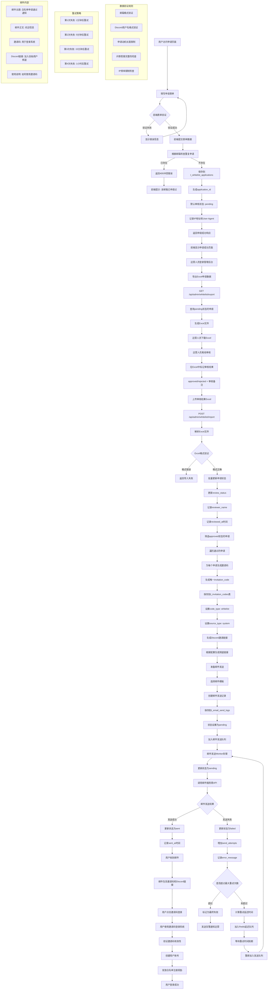

```mermaid
flowchart TD
    A[用户访问申请页面] --> B[填写申请表单]
    B --> C{前端表单验证}
    C -->|验证失败| D[显示错误信息]
    D --> B
    C -->|验证成功| E[前端提交表单数据]
    E --> F[根据邮箱检查重复申请]
    F -->|已存在| G[返回409冲突错误]
    G --> H[前端提示: 该邮箱已申请过]
    F -->|不存在| I[保存到t_whitelist_applications]
    I --> J[生成application_id]
    J --> K[默认审核状态: pending]
    K --> L[记录IP地址和User-Agent]
    L --> M[返回申请成功响应]
    M --> N[前端显示申请成功页面]
    
    N --> O[运营人员登录管理后台]
    O --> P[导出Excel申请数据]
    P --> P1[GET /api/admin/whitelist/export]
    P1 --> P2[查询pending状态的申请]
    P2 --> P3[生成Excel文件]
    P3 --> Q[运营人员下载Excel]
    Q --> R[运营人员离线审核]
    R --> S[在Excel中标记审核结果]
    S --> S1[approved/rejected + 审核备注]
    S1 --> T[上传审核结果Excel]
    T --> T1[POST /api/admin/whitelist/import]
    T1 --> T2[解析Excel文件]
    T2 --> T3{Excel格式验证}
    T3 -->|格式错误| T4[返回导入失败]
    T3 -->|格式正确| U[批量更新申请状态]
    U --> U1[更新review_status]
    U1 --> U2[记录reviewer_name]
    U2 --> U3[记录reviewed_at时间]
    U3 --> V[筛选approved状态的申请]
    
    V --> W[遍历通过的申请]
    W --> X[为每个申请生成邀请码]
    X --> X1[生成唯一invitation_code]
    X1 --> X2[保存到t_invitation_codes表]
    X2 --> X3[设置code_type: whitelist]
    X3 --> X4[设置source_type: system]
    X4 --> Y[生成Discord邀请链接]
    Y --> Y1[根据配置生成频道链接]
    Y1 --> Z[准备邮件发送]
    Z --> Z1[选择邮件模板]
    Z1 --> Z2[创建邮件发送记录]
    Z2 --> Z3[保存到t_email_send_logs]
    Z3 --> Z4[状态设置为pending]
    Z4 --> AA[加入邮件发送队列]
    
    AA --> BB[邮件发送Worker处理]
    BB --> CC[更新状态为sending]
    CC --> DD[调用邮件服务商API]
    DD --> EE{邮件发送结果}
    
    EE -->|发送成功| FF[更新状态为sent]
    FF --> GG[记录sent_at时间]
    GG --> HH[用户收到邮件]
    HH --> II[邮件包含邀请码和Discord链接]
    II --> JJ[用户点击邀请码登录]
    
    EE -->|发送失败| KK[更新状态为failed]
    KK --> LL[增加send_attempts]
    LL --> MM[记录error_message]
    MM --> NN{是否超过最大重试次数}
    NN -->|超过| OO[标记为最终失败]
    OO --> PP[发送告警通知运营]
    NN -->|未超过| QQ[计算重试延迟时间]
    QQ --> RR[加入Redis延迟队列]
    RR --> SS[等待重试时间到期]
    SS --> TT[重新加入发送队列]
    TT --> BB
    
    JJ --> UU[用户使用邀请码登录系统]
    UU --> VV[验证邀请码有效性]
    VV --> WW[创建用户账号]
    WW --> XX[发放白名单注册奖励]
    XX --> YY[用户登录成功]
    
    subgraph "数据验证规则"
        V1[邮箱格式验证]
        V2[Discord用户名格式验证]
        V3[申请动机长度限制]
        V4[问卷答案完整性检查]
        V5[IP频率限制检查]
    end
    
    subgraph "重试策略"
        R1[第1次失败: 1分钟后重试]
        R2[第2次失败: 5分钟后重试]
        R3[第3次失败: 15分钟后重试]
        R4[第4次失败: 1小时后重试]
    end
    
    subgraph "邮件内容"
        M1[邮件主题: 白名单申请通过通知]
        M2[邮件正文: 欢迎信息]
        M3[邀请码: 用于登录系统]
        M4[Discord链接: 加入创始用户频道]
        M5[使用说明: 如何使用邀请码]
    end
```