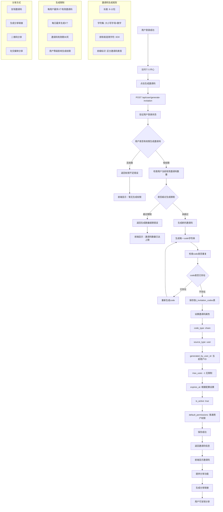

```mermaid
flowchart TD
    A[用户登录成功] --> B[访问个人中心]
    B --> C[点击生成邀请码]
    C --> D[POST /api/user/generate-invitation]
    
    D --> E[验证用户登录状态]
    E --> F{用户是否有权限生成邀请码}
    F -->|无权限| G[返回权限不足错误]
    G --> H[前端显示：暂无生成权限]
    
    F -->|有权限| I[检查用户当前有效邀请码数量]
    I --> J{是否超过生成限制}
    J -->|超过限制| K[返回生成数量超限错误]
    K --> L[前端显示：邀请码数量已达上限]
    
    J -->|未超过| M[生成新的邀请码]
    M --> N[生成唯一code字符串]
    N --> O[检查code是否重复]
    O --> P{code是否已存在}
    P -->|已存在| Q[重新生成code]
    Q --> N
    
    P -->|不存在| R[保存到t_invitation_codes表]
    R --> S[设置邀请码属性]
    S --> T[code_type: share]
    T --> U[source_type: user]
    U --> V[generated_by_user_id: 当前用户ID]
    V --> W[max_uses: -1 无限制]
    W --> X[expires_at: 根据配置设置]
    X --> Y[is_active: true]
    Y --> Z[default_permissions: 普通用户权限]
    Z --> AA[保存成功]
    
    AA --> BB[返回邀请码信息]
    BB --> CC[前端显示邀请码]
    CC --> DD[提供分享功能]
    DD --> EE[生成分享链接]
    EE --> FF[用户可复制分享]
    
    subgraph "邀请码生成规则"
        GR1[长度: 8-12位]
        GR2[字符集: 大小写字母+数字]
        GR3[排除易混淆字符: 0OIl]
        GR4[前缀标识: 区分邀请码类型]
    end
    
    subgraph "生成限制"
        GL1[每用户最多3个有效邀请码]
        GL2[每日最多生成5个]
        GL3[邀请码有效期30天]
        GL4[用户等级影响生成权限]
    end
    
    subgraph "分享方式"
        S1[复制邀请码]
        S2[生成分享链接]
        S3[二维码分享]
        S4[社交媒体分享]
    end
```