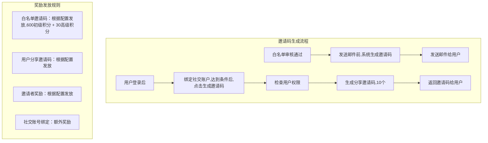

```mermaid
flowchart TD
    
    

    subgraph "邀请码生成流程"
        IG1[白名单审核通过] --> IG2[发送邮件前,系统生成邀请码]
        IG2 --> IG3[发送邮件给用户]
        
        UG1[用户登录后] --> UG2[绑定社交账户,达到条件后,点击生成邀请码]
        UG2 --> UG3[检查用户权限]
        UG3 --> UG4[生成分享邀请码,10个]
        UG4 --> UG5[返回邀请码给用户]
    end
    
    subgraph "奖励发放规则"
        R1[白名单邀请码：根据配置发放,600初级积分 + 30高级积分]
        R2[用户分享邀请码：根据配置发放]
        R3[邀请者奖励：根据配置发放]
        R4[社交账号绑定：额外奖励]
    end
  
```