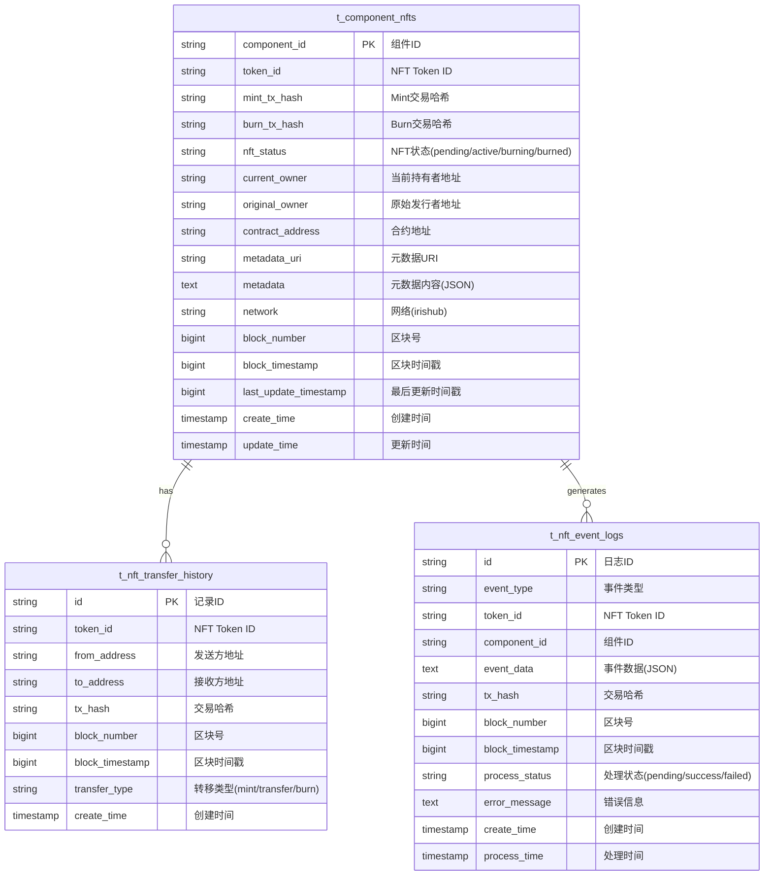

```mermaid
erDiagram
    t_component_nfts {
        string component_id PK "组件ID"
        string token_id "NFT Token ID"
        string mint_tx_hash "Mint交易哈希"
        string burn_tx_hash "Burn交易哈希"
        string nft_status "NFT状态(pending/active/burning/burned)"
        string current_owner "当前持有者地址"
        string original_owner "原始发行者地址"
        string contract_address "合约地址"
        string metadata_uri "元数据URI"
        text metadata "元数据内容(JSON)"
        string network "网络(irishub)"
        bigint block_number "区块号"
        bigint block_timestamp "区块时间戳"
        bigint last_update_timestamp "最后更新时间戳"
        timestamp create_time "创建时间"
        timestamp update_time "更新时间"
    }
    
    t_nft_transfer_history {
        string id PK "记录ID"
        string token_id "NFT Token ID"
        string from_address "发送方地址"
        string to_address "接收方地址"
        string tx_hash "交易哈希"
        bigint block_number "区块号"
        bigint block_timestamp "区块时间戳"
        string transfer_type "转移类型(mint/transfer/burn)"
        timestamp create_time "创建时间"
    }
    
    t_nft_event_logs {
        string id PK "日志ID"
        string event_type "事件类型"
        string token_id "NFT Token ID"
        string component_id "组件ID"
        text event_data "事件数据(JSON)"
        string tx_hash "交易哈希"
        bigint block_number "区块号"
        bigint block_timestamp "区块时间戳"
        string process_status "处理状态(pending/success/failed)"
        text error_message "错误信息"
        timestamp create_time "创建时间"
        timestamp process_time "处理时间"
    }
    
    t_component_nfts ||--o{ t_nft_transfer_history : "has"
    t_component_nfts ||--o{ t_nft_event_logs : "generates"
```