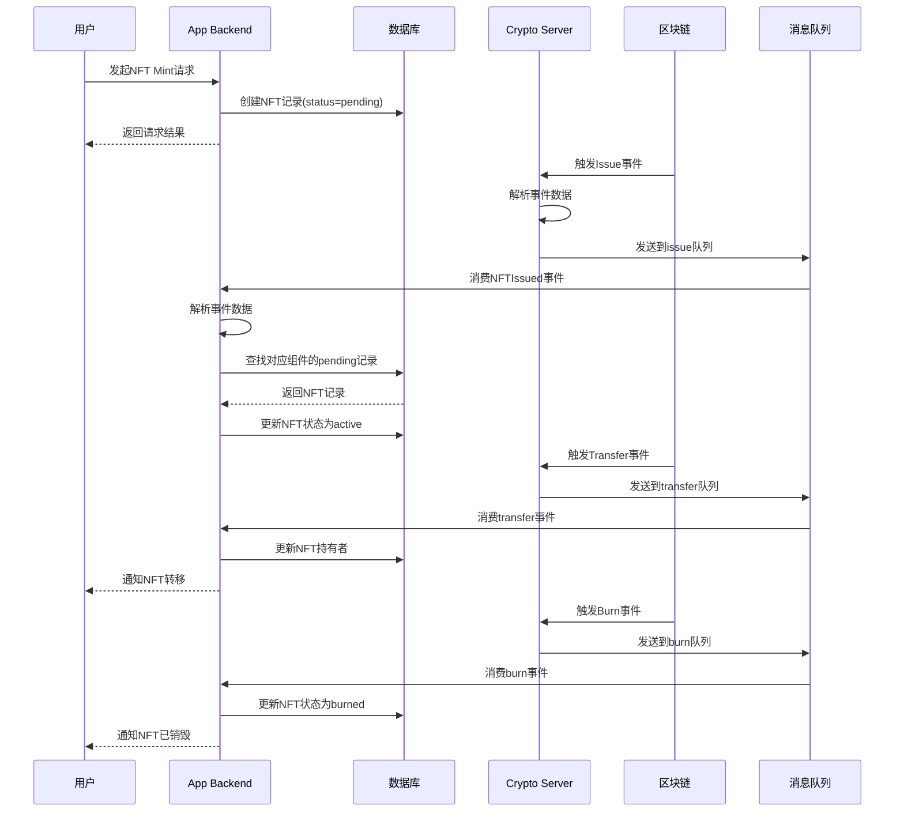

```mermaid
sequenceDiagram
    participant U as 用户
    participant AB as App Backend
    participant DB as 数据库
    participant CS as Crypto Server
    participant BC as 区块链
    participant MQ as 消息队列
    
    %% NFT Mint 流程
    U->>AB: 发起NFT Mint请求
    AB->>DB: 创建NFT记录(status=pending)
    AB-->>U: 返回请求结果
    
    %% 区块链事件监听
    BC->>CS: 触发Issue事件
    CS->>CS: 解析事件数据
    CS->>MQ: 发送到issue队列
    
    %% App Backend 处理
    MQ->>AB: 消费NFTIssued事件
    AB->>AB: 解析事件数据
    AB->>DB: 查找对应组件的pending记录
    DB-->>AB: 返回NFT记录
    AB->>DB: 更新NFT状态为active
    
    %% Transfer 事件处理
    BC->>CS: 触发Transfer事件
    CS->>MQ: 发送到transfer队列
    MQ->>AB: 消费transfer事件
    AB->>DB: 更新NFT持有者
    AB-->>U: 通知NFT转移
    
    %% Burn 事件处理
    BC->>CS: 触发Burn事件
    CS->>MQ: 发送到burn队列
    MQ->>AB: 消费burn事件
    AB->>DB: 更新NFT状态为burned
    AB-->>U: 通知NFT已销毁
```