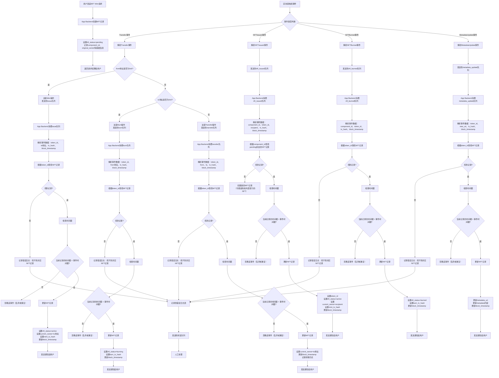

```mermaid
flowchart TD
    A[用户发起NFT Mint请求] --> B[App Backend创建NFT记录]
    B --> C[设置nft_status=pending<br/>记录component_id、original_owner等基础信息]
    C --> D[返回请求结果给用户]
    
    %% 区块链事件监听
    E[区块链触发事件] --> F{事件类型判断}
    F -->|Transfer事件| G[解析Transfer事件]
    F -->|NFTIssued事件| H[解析NFTIssued事件]
    F -->|NFTBurned事件| I[解析NFTBurned事件]
    F -->|MetadataUpdate事件| J[解析MetadataUpdate事件]
    
    %% Transfer事件处理逻辑
    G --> G1{from地址是否为0x0?}
    G1 -->|是| G2[这是Mint操作<br/>发送到issue队列]
    G1 -->|否| G3{to地址是否为0x0?}
    G3 -->|是| G4[这是Burn操作<br/>发送到burn队列]
    G3 -->|否| G5[这是Transfer操作<br/>发送到transfer队列]
    
    %% NFTIssued事件处理
    H --> H1[发送到nft_issued队列]
    
    %% NFTBurned事件处理
    I --> I1[发送到nft_burned队列]
    
    %% MetadataUpdate事件处理
    J --> J1[发送到metadata_update队列]
    
    %% 消息队列处理
    G2 --> K[App Backend消费issue队列]
    G5 --> L[App Backend消费transfer队列]
    G4 --> M[App Backend消费burn队列]
    H1 --> N[App Backend消费nft_issued队列]
    I1 --> O[App Backend消费nft_burned队列]
    J1 --> P[App Backend消费metadata_update队列]
    
    %% Issue事件处理（Transfer from=0x0）
    K --> K1[解析事件数据：token_id、to地址、tx_hash、block_timestamp]
    K1 --> K2[根据token_id查找NFT记录]
    K2 --> K3{找到记录?}
    K3 -->|否| K4[记录错误日志：找不到对应NFT记录]
    K3 -->|是| K5[检查时间戳]
    K5 --> K6{当前记录的时间戳 < 事件时间戳?}
    K6 -->|否| K7[忽略该事件（乱序或重复）]
    K6 -->|是| K8[更新NFT记录]
    K8 --> K9[设置nft_status=active<br/>设置current_owner=to地址<br/>设置mint_tx_hash<br/>更新block_timestamp]
    K9 --> K10[发送通知给用户]
    
    %% Transfer事件处理（正常转移）
    L --> L1[解析事件数据：token_id、from、to、tx_hash、block_timestamp]
    L1 --> L2[根据token_id查找NFT记录]
    L2 --> L3{找到记录?}
    L3 -->|否| L4[记录错误日志：找不到对应NFT记录]
    L3 -->|是| L5[检查时间戳]
    L5 --> L6{当前记录的时间戳 < 事件时间戳?}
    L6 -->|否| L7[忽略该事件（乱序或重复）]
    L6 -->|是| L8[更新NFT记录]
    L8 --> L9[设置current_owner=to地址<br/>更新block_timestamp<br/>记录转移历史]
    L9 --> L10[发送通知给用户]
    
    %% Burn事件处理（Transfer to=0x0）
    M --> M1[解析事件数据：token_id、from地址、tx_hash、block_timestamp]
    M1 --> M2[根据token_id查找NFT记录]
    M2 --> M3{找到记录?}
    M3 -->|否| M4[记录错误日志：找不到对应NFT记录]
    M3 -->|是| M5[检查时间戳]
    M5 --> M6{当前记录的时间戳 < 事件时间戳?}
    M6 -->|否| M7[忽略该事件（乱序或重复）]
    M6 -->|是| M8[更新NFT记录]
    M8 --> M9[设置nft_status=burning<br/>设置burn_tx_hash<br/>更新block_timestamp]
    M9 --> M10[发送通知给用户]
    
    %% NFTIssued事件处理
    N --> N1[解析事件数据：component_id、token_id、recipient、tx_hash、block_timestamp]
    N1 --> N2[根据component_id查找pending状态的NFT记录]
    N2 --> N3{找到记录?}
    N3 -->|否| N4[创建新的NFT记录<br/>（可能是系统外部发行的NFT）]
    N3 -->|是| N5[检查时间戳]
    N5 --> N6{当前记录的时间戳 < 事件时间戳?}
    N6 -->|否| N7[忽略该事件（乱序或重复）]
    N6 -->|是| N8[更新NFT记录]
    N8 --> N9[设置token_id<br/>设置nft_status=active<br/>设置current_owner=recipient<br/>设置mint_tx_hash<br/>更新block_timestamp]
    N9 --> N10[发送通知给用户]
    
    %% NFTBurned事件处理
    O --> O1[解析事件数据：component_id、token_id、tx_hash、block_timestamp]
    O1 --> O2[根据token_id查找NFT记录]
    O2 --> O3{找到记录?}
    O3 -->|否| O4[记录错误日志：找不到对应NFT记录]
    O3 -->|是| O5[检查时间戳]
    O5 --> O6{当前记录的时间戳 < 事件时间戳?}
    O6 -->|否| O7[忽略该事件（乱序或重复）]
    O6 -->|是| O8[更新NFT记录]
    O8 --> O9[设置nft_status=burned<br/>设置burn_tx_hash<br/>更新block_timestamp]
    O9 --> O10[发送通知给用户]
    
    %% MetadataUpdate事件处理
    P --> P1[解析事件数据：token_id、new_uri、tx_hash、block_timestamp]
    P1 --> P2[根据token_id查找NFT记录]
    P2 --> P3{找到记录?}
    P3 -->|否| P4[记录错误日志：找不到对应NFT记录]
    P3 -->|是| P5[检查时间戳]
    P5 --> P6{当前记录的时间戳 < 事件时间戳?}
    P6 -->|否| P7[忽略该事件（乱序或重复）]
    P6 -->|是| P8[更新NFT记录]
    P8 --> P9[更新metadata_uri<br/>更新metadata内容<br/>更新block_timestamp]
    P9 --> P10[发送通知给用户]
    
    %% 错误处理
    K4 --> Q[记录到错误日志表]
    L4 --> Q
    M4 --> Q
    O4 --> Q
    P4 --> Q
    Q --> R[发送到死信队列]
    R --> S[人工处理]
```