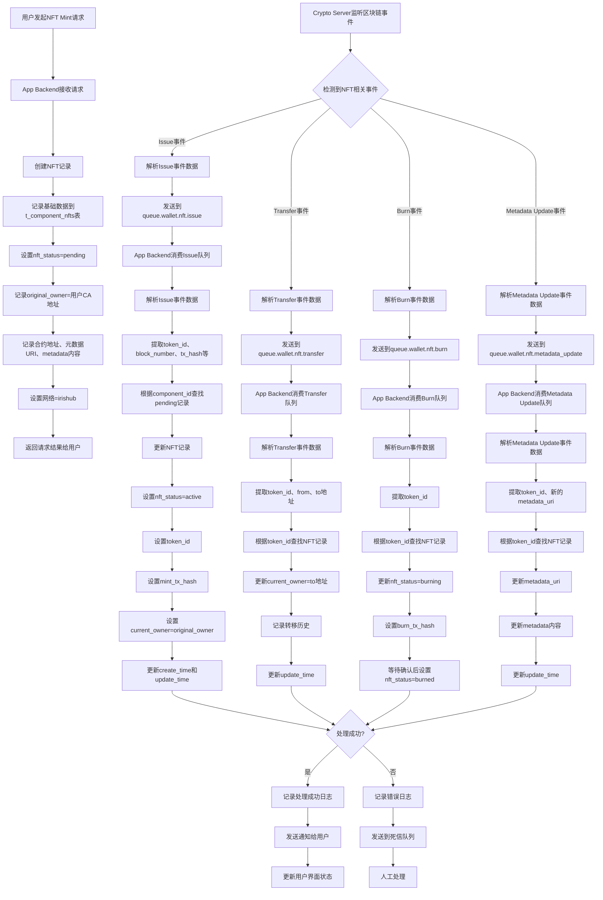

```mermaid
graph TD
    A[用户发起NFT Mint请求] --> B[App Backend接收请求]
    B --> C[创建NFT记录]
    C --> D[记录基础数据到t_component_nfts表]
    D --> E[设置nft_status=pending]
    E --> F[记录original_owner=用户CA地址]
    F --> G[记录合约地址、元数据URI、metadata内容]
    G --> H[设置网络=irishub]
    H --> I[返回请求结果给用户]
    
    %% Crypto Server 事件处理
    J[Crypto Server监听区块链事件] --> K{检测到NFT相关事件}
    K -->|Issue事件| L[解析Issue事件数据]
    K -->|Transfer事件| M[解析Transfer事件数据]
    K -->|Burn事件| N[解析Burn事件数据]
    K -->|Metadata Update事件| O[解析Metadata Update事件数据]
    
    %% 发送到MQ队列
    L --> P[发送到queue.wallet.nft.issue]
    M --> Q[发送到queue.wallet.nft.transfer]
    N --> R[发送到queue.wallet.nft.burn]
    O --> S[发送到queue.wallet.nft.metadata_update]
    
    %% App Backend 消费队列
    P --> T[App Backend消费Issue队列]
    Q --> U[App Backend消费Transfer队列]
    R --> V[App Backend消费Burn队列]
    S --> W[App Backend消费Metadata Update队列]
    
    %% 处理Issue事件
    T --> X[解析Issue事件数据]
    X --> Y[提取token_id、block_number、tx_hash等]
    Y --> Z[根据component_id查找pending记录]
    Z --> AA[更新NFT记录]
    AA --> BB[设置nft_status=active]
    BB --> CC[设置token_id]
    CC --> DD[设置mint_tx_hash]
    DD --> EE[设置current_owner=original_owner]
    EE --> FF[更新create_time和update_time]
    
    %% 处理Transfer事件
    U --> GG[解析Transfer事件数据]
    GG --> HH[提取token_id、from、to地址]
    HH --> II[根据token_id查找NFT记录]
    II --> JJ[更新current_owner=to地址]
    JJ --> KK[记录转移历史]
    KK --> LL[更新update_time]
    
    %% 处理Burn事件
    V --> MM[解析Burn事件数据]
    MM --> NN[提取token_id]
    NN --> OO[根据token_id查找NFT记录]
    OO --> PP[更新nft_status=burning]
    PP --> QQ[设置burn_tx_hash]
    QQ --> RR[等待确认后设置nft_status=burned]
    
    %% 处理Metadata Update事件
    W --> SS[解析Metadata Update事件数据]
    SS --> TT[提取token_id、新的metadata_uri]
    TT --> UU[根据token_id查找NFT记录]
    UU --> VV[更新metadata_uri]
    VV --> WW[更新metadata内容]
    WW --> XX[更新update_time]
    
    %% 错误处理
    FF --> YY{处理成功?}
    LL --> YY
    RR --> YY
    XX --> YY
    YY -->|是| ZZ[记录处理成功日志]
    YY -->|否| AAA[记录错误日志]
    AAA --> BBB[发送到死信队列]
    BBB --> CCC[人工处理]
    
    %% 通知用户
    ZZ --> DDD[发送通知给用户]
    DDD --> EEE[更新用户界面状态]
```