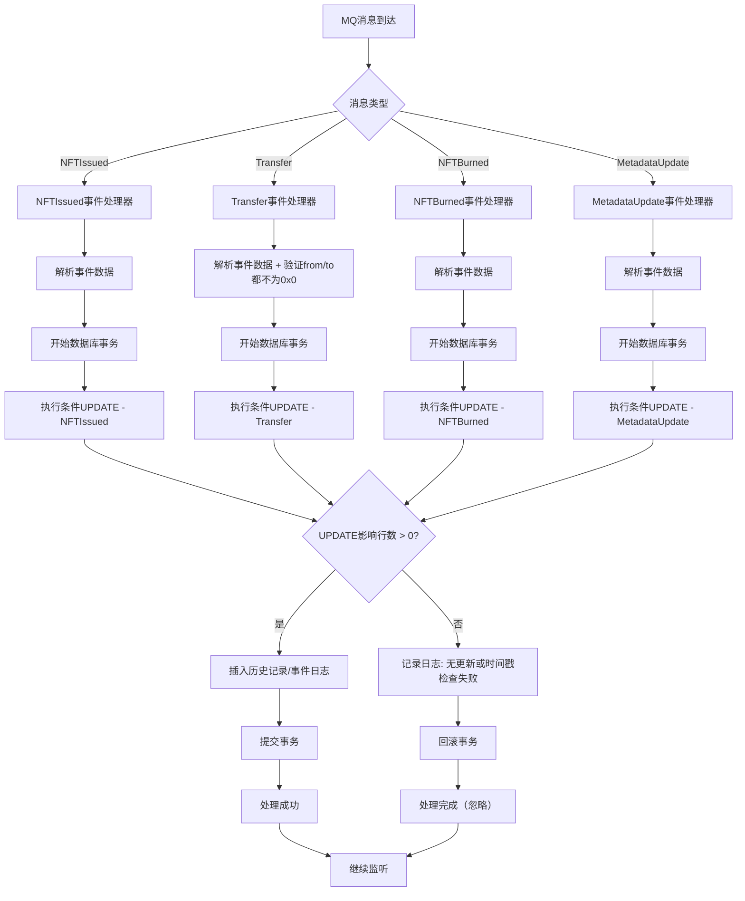

```mermaid
flowchart TD
    A[MQ消息到达] --> B{消息类型}
    
    %% 四种事件类型
    B -->|NFTIssued| C[NFTIssued事件处理器]
    B -->|Transfer| D[Transfer事件处理器]
    B -->|NFTBurned| E[NFTBurned事件处理器]
    B -->|MetadataUpdate| F[MetadataUpdate事件处理器]
    
    %% 通用处理流程
    C --> G[解析事件数据]
    D --> H[解析事件数据 + 验证from/to都不为0x0]
    E --> I[解析事件数据]
    F --> J[解析事件数据]
    
    G --> K[开始数据库事务]
    H --> L[开始数据库事务]
    I --> M[开始数据库事务]
    J --> N[开始数据库事务]
    
    K --> O[执行条件UPDATE - NFTIssued]
    L --> P[执行条件UPDATE - Transfer]
    M --> Q[执行条件UPDATE - NFTBurned]
    N --> R[执行条件UPDATE - MetadataUpdate]
    
    O --> S{UPDATE影响行数 > 0?}
    P --> S
    Q --> S
    R --> S
    
    S -->|否| T[记录日志: 无更新或时间戳检查失败]
    S -->|是| U[插入历史记录/事件日志]
    
    U --> V[提交事务]
    T --> W[回滚事务]
    
    V --> X[处理成功]
    W --> Y[处理完成（忽略）]
    
    X --> Z[继续监听]
    Y --> Z
```