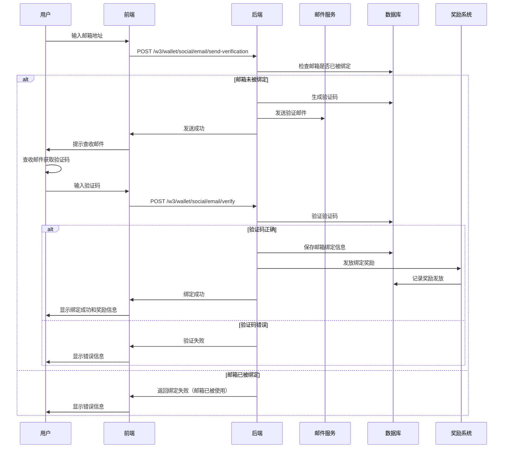

```mermaid
sequenceDiagram
    participant User as 用户
    participant Frontend as 前端
    participant Backend as 后端
    participant Email as 邮件服务
    
    participant DB as 数据库
    participant Reward as 奖励系统

    User->>Frontend: 输入邮箱地址
    Frontend->>Backend: POST /w3/wallet/social/email/send-verification
    Backend->>DB: 检查邮箱是否已被绑定
    
    alt 邮箱未被绑定
        Backend->>DB: 生成验证码
        Backend->>Email: 发送验证邮件
        Backend->>Frontend: 发送成功
        Frontend->>User: 提示查收邮件
        
        User->>User: 查收邮件获取验证码
        User->>Frontend: 输入验证码
        Frontend->>Backend: POST /w3/wallet/social/email/verify
        Backend->>DB: 验证验证码
        
        alt 验证码正确
            Backend->>DB: 保存邮箱绑定信息
            Backend->>Reward: 发放绑定奖励
            Reward->>DB: 记录奖励发放
            Backend->>Frontend: 绑定成功
            Frontend->>User: 显示绑定成功和奖励信息
        else 验证码错误
            Backend->>Frontend: 验证失败
            Frontend->>User: 显示错误信息
        end
    else 邮箱已被绑定
        Backend->>Frontend: 返回绑定失败（邮箱已被使用）
        Frontend->>User: 显示错误信息
    end
```