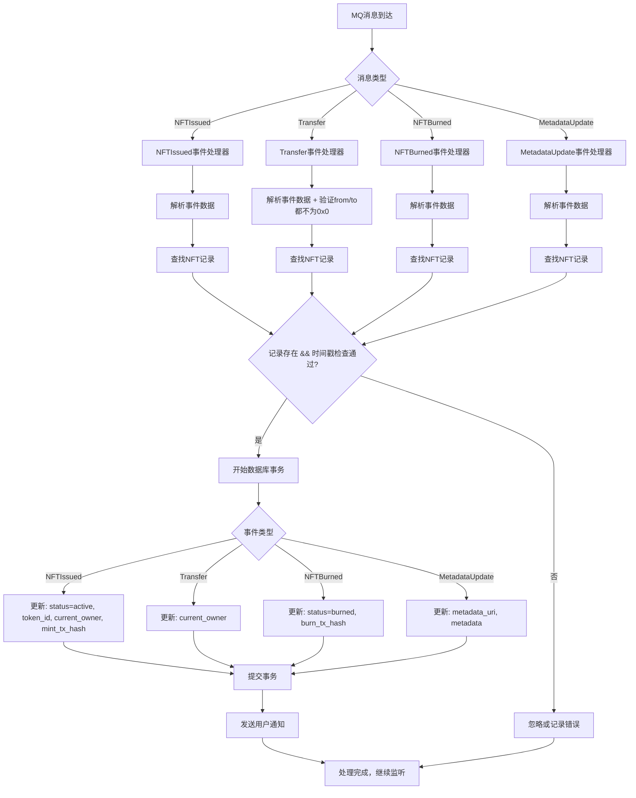

```mermaid
flowchart TD
    A[MQ消息到达] --> B{消息类型}
    
    %% 四种事件类型
    B -->|NFTIssued| C[NFTIssued事件处理器]
    B -->|Transfer| D[Transfer事件处理器]
    B -->|NFTBurned| E[NFTBurned事件处理器]
    B -->|MetadataUpdate| F[MetadataUpdate事件处理器]
    
    %% 通用处理流程
    C --> G[解析事件数据]
    D --> H[解析事件数据 + 验证from/to都不为0x0]
    E --> I[解析事件数据]
    F --> J[解析事件数据]
    
    G --> K[查找NFT记录]
    H --> L[查找NFT记录]
    I --> M[查找NFT记录]
    J --> N[查找NFT记录]
    
    K --> O{记录存在 && 时间戳检查通过?}
    L --> O
    M --> O
    N --> O
    
    O -->|否| P[忽略或记录错误]
    O -->|是| Q[开始数据库事务]
    
    Q --> R{事件类型}
    R -->|NFTIssued| S[更新: status=active, token_id, current_owner, mint_tx_hash]
    R -->|Transfer| T[更新: current_owner]
    R -->|NFTBurned| U[更新: status=burned, burn_tx_hash]
    R -->|MetadataUpdate| V[更新: metadata_uri, metadata]
    
    S --> Y[提交事务]
    T --> Y
    U --> Y
    V --> Y
    
    Y --> Z[发送用户通知]
    Z --> AA[处理完成，继续监听]
    
    P --> AA
```