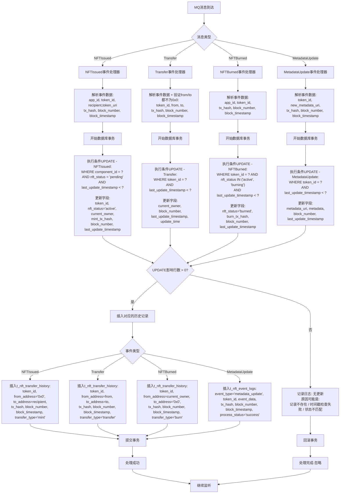

```mermaid
flowchart TD
    A[MQ消息到达] --> B{消息类型}
    
    %% 四种事件类型
    B -->|NFTIssued| C[NFTIssued事件处理器]
    B -->|Transfer| D[Transfer事件处理器]
    B -->|NFTBurned| E[NFTBurned事件处理器]
    B -->|MetadataUpdate| F[MetadataUpdate事件处理器]
    
    %% 解析事件数据
    C --> G["解析事件数据:<br/>app_id, token_id, recipient,token_uri<br/>tx_hash, block_number, block_timestamp"]
    D --> H["解析事件数据 + 验证from/to都不为0x0:<br/>token_id, from, to,<br/>tx_hash, block_number, block_timestamp"]
    E --> I["解析事件数据:<br/>app_id, token_id,<br/>tx_hash, block_number, block_timestamp"]
    F --> J["解析事件数据:<br/>token_id, new_metadata_uri,<br/>tx_hash, block_number, block_timestamp"]
    
    G --> K[开始数据库事务]
    H --> L[开始数据库事务]
    I --> M[开始数据库事务]
    J --> N[开始数据库事务]
    
    K --> O["执行条件UPDATE - NFTIssued:<br/>WHERE component_id = ? AND nft_status = 'pending'<br/>AND last_update_timestamp < ?<br/><br/>更新字段:<br/>token_id, nft_status='active', current_owner,<br/>mint_tx_hash, block_number, last_update_timestamp"]
    
    L --> P["执行条件UPDATE - Transfer:<br/>WHERE token_id = ?<br/>AND last_update_timestamp < ?<br/><br/>更新字段:<br/>current_owner, block_number,<br/>last_update_timestamp, update_time"]
    
    M --> Q["执行条件UPDATE - NFTBurned:<br/>WHERE token_id = ? AND nft_status IN ('active', 'burning')<br/>AND last_update_timestamp < ?<br/><br/>更新字段:<br/>nft_status='burned', burn_tx_hash,<br/>block_number, last_update_timestamp"]
    
    N --> R["执行条件UPDATE - MetadataUpdate:<br/>WHERE token_id = ?<br/>AND last_update_timestamp < ?<br/><br/>更新字段:<br/>metadata_uri, metadata,<br/>block_number, last_update_timestamp"]
    
    O --> S{UPDATE影响行数 > 0?}
    P --> S
    Q --> S
    R --> S
    
    S -->|否| T["记录日志: 无更新<br/>原因可能是:<br/>记录不存在 / 时间戳检查失败 / 状态不匹配"]
    S -->|是| U[插入对应的历史记录]
    
    U --> U1{事件类型}
    U1 -->|NFTIssued| U2["插入t_nft_transfer_history:<br/>token_id, from_address='0x0', to_address=recipient,<br/>tx_hash, block_number, block_timestamp, transfer_type='mint'"]
    
    U1 -->|Transfer| U3["插入t_nft_transfer_history:<br/>token_id, from_address=from, to_address=to,<br/>tx_hash, block_number, block_timestamp, transfer_type='transfer'"]
    
    U1 -->|NFTBurned| U4["插入t_nft_transfer_history:<br/>token_id, from_address=current_owner, to_address='0x0',<br/>tx_hash, block_number, block_timestamp, transfer_type='burn'"]
    
    U1 -->|MetadataUpdate| U5["插入t_nft_event_logs:<br/>event_type='metadata_update', token_id, event_data,<br/>tx_hash, block_number, block_timestamp, process_status='success'"]
    
    U2 --> V[提交事务]
    U3 --> V
    U4 --> V
    U5 --> V
    
    T --> W[回滚事务]
    
    V --> X[处理成功]
    W --> Y[处理完成-忽略]
    
    X --> Z[继续监听]
    Y --> Z
```