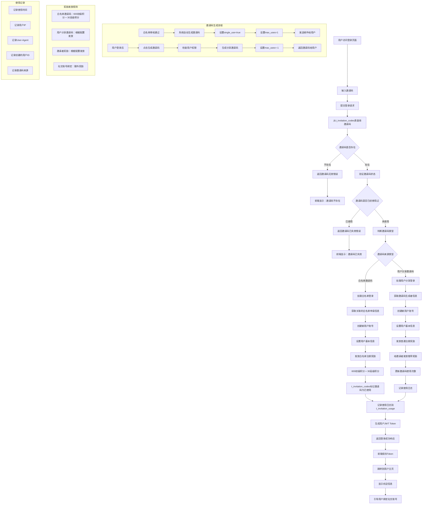

```mermaid
flowchart TD
    A[用户访问登录页面] --> B[输入邀请码]
    B --> E[提交登录请求]
    E --> H[从t_invitation_codes表查询邀请码]
    H --> I{邀请码是否存在}
    I -->|不存在| J[返回邀请码无效错误]
    J --> K[前端显示：邀请码不存在]
    
    I -->|存在| L[验证邀请码状态]
    L --> M{邀请码是否已经使用过}
    M -->|已使用| N[返回邀请码已失效错误]
    N --> O[前端显示：邀请码已失效]
    
    M -->|未使用| X[判断邀请码类型]
    X --> Y{邀请码来源类型}
    
    Y -->|白名单邀请码| Z[处理白名单登录]
    Z --> Z1[获取关联的白名单申请信息]
    Z1 --> Z2[创建新用户账号]
    Z2 --> Z3[设置用户基本信息]
    Z3 --> Z4[发放白名单注册奖励]
    Z4 --> Z5[600初级积分 + 30高级积分]
    Z5 --> Z6[t_invitation_codes标记邀请码为已使用]
    Z6 --> AA[记录使用日志到t_invitation_usage]
    
    Y -->|用户分享邀请码| BB[处理用户分享登录]
    BB --> BB1[获取邀请码生成者信息]
    BB1 --> BB2[创建新用户账号]
    BB2 --> BB3[设置用户基本信息]
    BB3 --> BB4[发放普通注册奖励]
    BB4 --> BB5[给邀请者发放推荐奖励]
    BB5 --> BB6[更新邀请码使用次数]
    BB6 --> BB7[记录使用日志]
    BB7 --> AA
    
    AA --> CC[生成用户JWT Token]
    CC --> DD[返回登录成功响应]
    DD --> EE[前端保存Token]
    EE --> FF[跳转到用户主页]
    FF --> GG[显示欢迎信息]
    GG --> HH[引导用户绑定社交账号]
    
    subgraph "邀请码生成流程"
        IG1[白名单审核通过] --> IG2[系统自动生成邀请码]
        IG2 --> IG3[设置single_use=true]
        IG3 --> IG4[设置max_uses=1]
        IG4 --> IG5[发送邮件给用户]
        
        UG1[用户登录后] --> UG2[点击生成邀请码]
        UG2 --> UG3[检查用户权限]
        UG3 --> UG4[生成分享邀请码]
        UG4 --> UG5[设置max_uses=-1]
        UG5 --> UG6[返回邀请码给用户]
    end
    
    subgraph "奖励发放规则"
        R1[白名单邀请码：600初级积分 + 30高级积分]
        R2[用户分享邀请码：根据配置发放]
        R3[邀请者奖励：根据配置发放]
        R4[社交账号绑定：额外奖励]
    end
    
    subgraph "使用记录"
        L1[记录使用时间]
        L2[记录用户IP]
        L3[记录User-Agent]
        L4[记录创建的用户ID]
        L5[记录邀请码来源]
    end
```