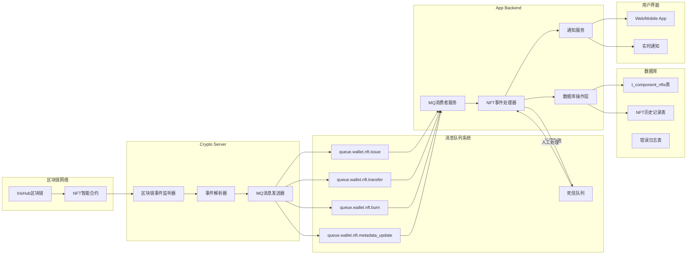

```mermaid
graph LR
    subgraph "区块链网络"
        A[IrisHub区块链]
        B[NFT智能合约]
    end
    
    subgraph "Crypto Server"
        C[区块链事件监听器]
        D[事件解析器]
        E[MQ消息发送器]
    end
    
    subgraph "消息队列系统"
        F[queue.wallet.nft.issue]
        G[queue.wallet.nft.transfer]
        H[queue.wallet.nft.burn]
        I[queue.wallet.nft.metadata_update]
        J[死信队列]
    end
    
    subgraph "App Backend"
        K[MQ消费者服务]
        L[NFT事件处理器]
        M[数据库操作层]
        N[通知服务]
    end
    
    subgraph "数据库"
        O[t_component_nfts表]
        P[NFT历史记录表]
        Q[错误日志表]
    end
    
    subgraph "用户界面"
        R[Web/Mobile App]
        S[实时通知]
    end
    
    %% 数据流向
    A --> B
    B --> C
    C --> D
    D --> E
    E --> F
    E --> G
    E --> H
    E --> I
    
    F --> K
    G --> K
    H --> K
    I --> K
    
    K --> L
    L --> M
    M --> O
    M --> P
    
    L --> N
    N --> R
    N --> S
    
    %% 错误处理
    L -->|处理失败| J
    J -->|人工处理| L
```