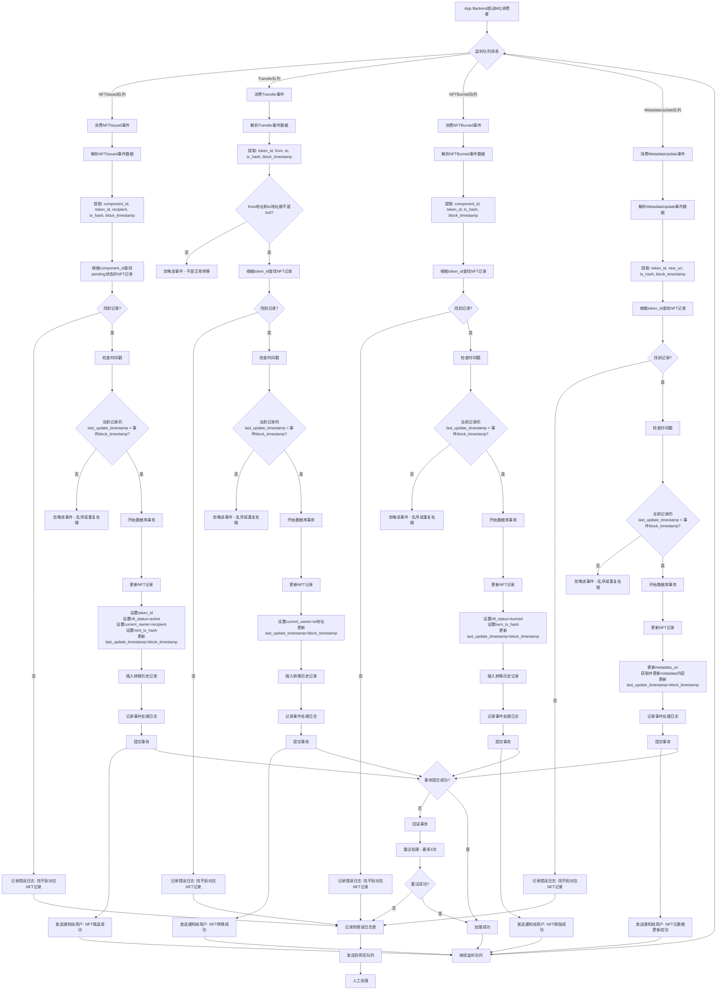

```mermaid
flowchart TD
    A[App Backend启动MQ消费者] --> B{监听队列消息}
    
    B -->|NFTIssued队列| C[消费NFTIssued事件]
    B -->|Transfer队列| D[消费Transfer事件]
    B -->|NFTBurned队列| E[消费NFTBurned事件]
    B -->|MetadataUpdate队列| F[消费MetadataUpdate事件]
    
    %% NFTIssued事件处理流程
    C --> C1[解析NFTIssued事件数据]
    C1 --> C2[提取: component_id, token_id, recipient, tx_hash, block_timestamp]
    C2 --> C3[根据component_id查找pending状态的NFT记录]
    C3 --> C4{找到记录?}
    C4 -->|否| C5[记录错误日志: 找不到对应NFT记录]
    C4 -->|是| C6[检查时间戳]
    C6 --> C7{当前记录的last_update_timestamp < 事件block_timestamp?}
    C7 -->|否| C8[忽略该事件 - 乱序或重复处理]
    C7 -->|是| C9[开始数据库事务]
    C9 --> C10[更新NFT记录]
    C10 --> C11[设置token_id<br/>设置nft_status=active<br/>设置current_owner=recipient<br/>设置mint_tx_hash<br/>更新last_update_timestamp=block_timestamp]
    C11 --> C12[插入转移历史记录]
    C12 --> C13[记录事件处理日志]
    C13 --> C14[提交事务]
    C14 --> C15[发送通知给用户: NFT铸造成功]
    
    %% Transfer事件处理流程（只处理正常转移）
    D --> D1[解析Transfer事件数据]
    D1 --> D2[提取: token_id, from, to, tx_hash, block_timestamp]
    D2 --> D3{from地址和to地址都不是0x0?}
    D3 -->|否| D4[忽略该事件 - 不是正常转移]
    D3 -->|是| D5[根据token_id查找NFT记录]
    D5 --> D6{找到记录?}
    D6 -->|否| D7[记录错误日志: 找不到对应NFT记录]
    D6 -->|是| D8[检查时间戳]
    D8 --> D9{当前记录的last_update_timestamp < 事件block_timestamp?}
    D9 -->|否| D10[忽略该事件 - 乱序或重复处理]
    D9 -->|是| D11[开始数据库事务]
    D11 --> D12[更新NFT记录]
    D12 --> D13[设置current_owner=to地址<br/>更新last_update_timestamp=block_timestamp]
    D13 --> D14[插入转移历史记录]
    D14 --> D15[记录事件处理日志]
    D15 --> D16[提交事务]
    D16 --> D17[发送通知给用户: NFT转移成功]
    
    %% NFTBurned事件处理流程
    E --> E1[解析NFTBurned事件数据]
    E1 --> E2[提取: component_id, token_id, tx_hash, block_timestamp]
    E2 --> E3[根据token_id查找NFT记录]
    E3 --> E4{找到记录?}
    E4 -->|否| E5[记录错误日志: 找不到对应NFT记录]
    E4 -->|是| E6[检查时间戳]
    E6 --> E7{当前记录的last_update_timestamp < 事件block_timestamp?}
    E7 -->|否| E8[忽略该事件 - 乱序或重复处理]
    E7 -->|是| E9[开始数据库事务]
    E9 --> E10[更新NFT记录]
    E10 --> E11[设置nft_status=burned<br/>设置burn_tx_hash<br/>更新last_update_timestamp=block_timestamp]
    E11 --> E12[插入转移历史记录]
    E12 --> E13[记录事件处理日志]
    E13 --> E14[提交事务]
    E14 --> E15[发送通知给用户: NFT销毁成功]
    
    %% MetadataUpdate事件处理流程
    F --> F1[解析MetadataUpdate事件数据]
    F1 --> F2[提取: token_id, new_uri, tx_hash, block_timestamp]
    F2 --> F3[根据token_id查找NFT记录]
    F3 --> F4{找到记录?}
    F4 -->|否| F5[记录错误日志: 找不到对应NFT记录]
    F4 -->|是| F6[检查时间戳]
    F6 --> F7{当前记录的last_update_timestamp < 事件block_timestamp?}
    F7 -->|否| F8[忽略该事件 - 乱序或重复处理]
    F7 -->|是| F9[开始数据库事务]
    F9 --> F10[更新NFT记录]
    F10 --> F11[更新metadata_uri<br/>获取并更新metadata内容<br/>更新last_update_timestamp=block_timestamp]
    F11 --> F12[记录事件处理日志]
    F12 --> F13[提交事务]
    F13 --> F14[发送通知给用户: NFT元数据更新成功]
    
    %% 错误处理
    C5 --> G[记录到错误日志表]
    D7 --> G
    E5 --> G
    F5 --> G
    G --> H[发送到死信队列]
    H --> I[人工处理]
    
    %% 事务失败处理
    C14 --> J{事务提交成功?}
    D16 --> J
    E14 --> J
    F13 --> J
    J -->|否| K[回滚事务]
    K --> L[重试处理 - 最多3次]
    L --> M{重试成功?}
    M -->|否| G
    M -->|是| N[处理成功]
    J -->|是| N
    
    %% 处理完成
    C15 --> O[继续监听队列]
    D17 --> O
    E15 --> O
    F14 --> O
    N --> O
    O --> B
```