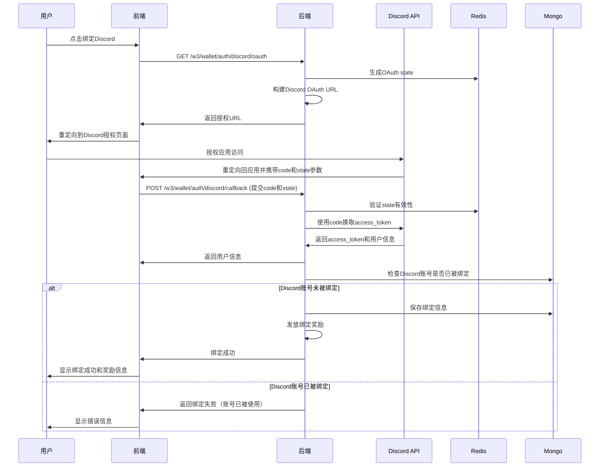

```mermaid

sequenceDiagram
    participant User as 用户
    participant Frontend as 前端
    participant Backend as 后端
    participant Discord as Discord API
    participant Redis as Redis
    participant DB as Mongo


    User->>Frontend: 点击绑定Discord
    Frontend->>Backend: GET /w3/wallet/auth/discord/oauth
    Backend->>Redis: 生成OAuth state
    Backend->>Backend: 构建Discord OAuth URL
    Backend->>Frontend: 返回授权URL
    Frontend->>User: 重定向到Discord授权页面
    
    User->>Discord: 授权应用访问
    Discord->>Frontend: 重定向回应用并携带code和state参数
    Frontend->>Backend: POST /w3/wallet/auth/discord/callback (提交code和state)
    Backend->>Redis: 验证state有效性
    Backend->>Discord: 使用code换取access_token
    Discord->>Backend: 返回access_token和用户信息
    Backend->>Frontend: 返回用户信息
    Backend->>DB: 检查Discord账号是否已被绑定
    
    alt Discord账号未被绑定
        Backend->>DB: 保存绑定信息
        Backend->>Backend: 发放绑定奖励
        Backend->>Frontend: 绑定成功
        Frontend->>User: 显示绑定成功和奖励信息
    else Discord账号已被绑定
        Backend->>Frontend: 返回绑定失败（账号已被使用）
        Frontend->>User: 显示错误信息
    end

```