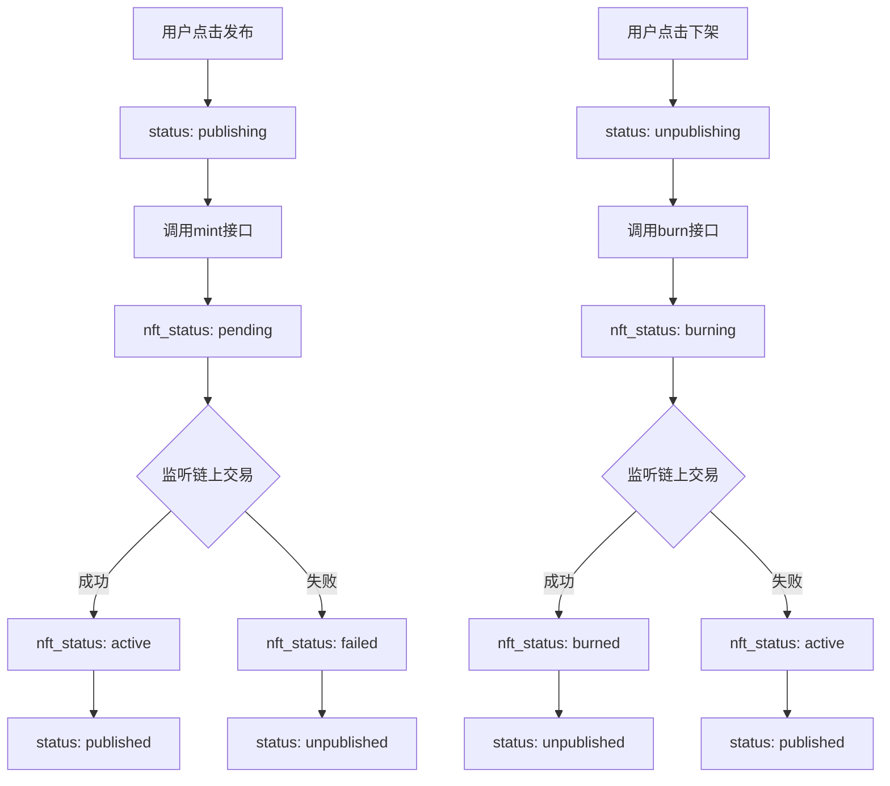

```mermaid
graph TD
    A[用户点击发布] --> B[status: publishing]
    B --> C[调用mint接口]
    C --> D[nft_status: pending]
    D --> E{监听链上交易}
    E -->|成功| F[nft_status: active]
    F --> G[status: published]
    E -->|失败| H[nft_status: failed]
    H --> I[status: unpublished]
    
    J[用户点击下架] --> K[status: unpublishing]
    K --> L[调用burn接口]
    L --> M[nft_status: burning]
    M --> N{监听链上交易}
    N -->|成功| O[nft_status: burned]
    O --> P[status: unpublished]
    N -->|失败| Q[nft_status: active]
    Q --> R[status: published]
```