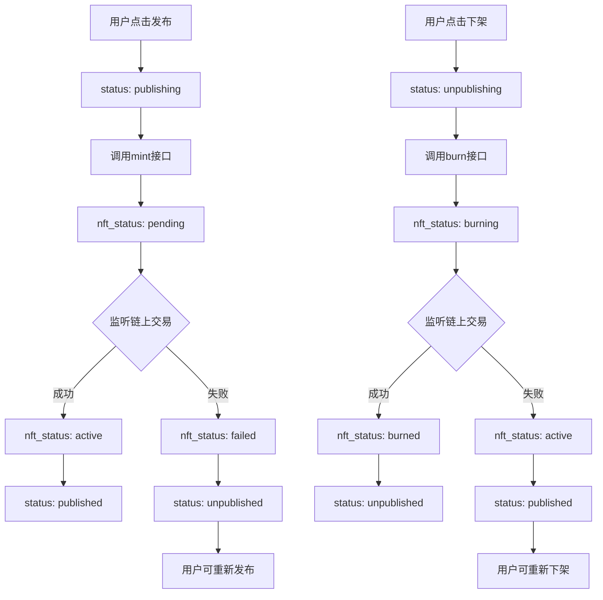

```mermaid
graph TD
    A[用户点击发布] --> B[status: publishing]
    B --> C[调用mint接口]
    C --> D[nft_status: pending]
    D --> E{监听链上交易}
    E -->|成功| F[nft_status: active]
    F --> G[status: published]
    E -->|失败| H[nft_status: failed]
    H --> I[status: unpublished]
    I --> J[用户可重新发布]
    
    K[用户点击下架] --> L[status: unpublishing]
    L --> M[调用burn接口]
    M --> N[nft_status: burning]
    N --> O{监听链上交易}
    O -->|成功| P[nft_status: burned]
    P --> Q[status: unpublished]
    O -->|失败| R[nft_status: active]
    R --> S[status: published]
    S --> T[用户可重新下架]
```