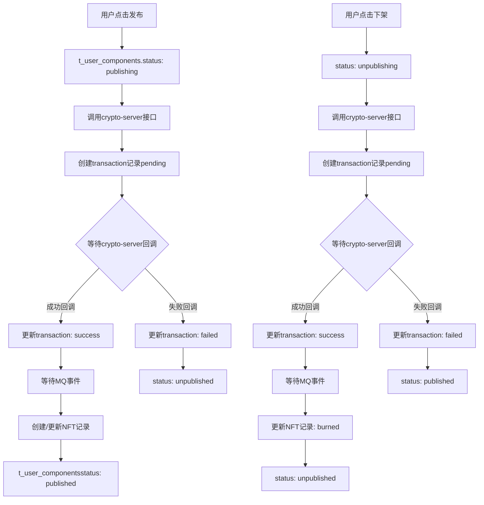

```mermaid

graph TD
    A[用户点击发布] --> B[t_user_components.status: publishing]
    B --> C[调用crypto-server接口]
    C --> D[创建transaction记录pending]
    D --> E{等待crypto-server回调}
    
    E -->|成功回调| F[更新transaction: success]
    F --> G[等待MQ事件]
    G --> H[创建/更新NFT记录]
    H --> I[t_user_componentsstatus: published]
    
    E -->|失败回调| J[更新transaction: failed]
    J --> K[status: unpublished]
    
    L[用户点击下架] --> M[status: unpublishing]
    M --> N[调用crypto-server接口]
    N --> O[创建transaction记录pending]
    O --> P{等待crypto-server回调}
    
    P -->|成功回调| Q[更新transaction: success]
    Q --> R[等待MQ事件]
    R --> S[更新NFT记录: burned]
    S --> T[status: unpublished]
    
    P -->|失败回调| U[更新transaction: failed]
    U --> V[status: published]

```