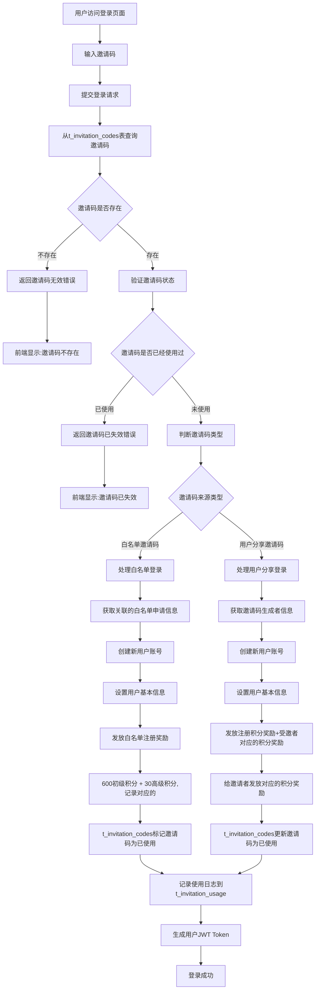

```mermaid

flowchart TD
    A[用户访问登录页面] --> B[输入邀请码]
    B --> E[提交登录请求]
    E --> H[从t_invitation_codes表查询邀请码]
    H --> I{邀请码是否存在}
    I -->|不存在| J[返回邀请码无效错误]
    J --> K[前端显示:邀请码不存在]
    
    I -->|存在| L[验证邀请码状态]
    L --> M{邀请码是否已经使用过}
    M -->|已使用| N[返回邀请码已失效错误]
    N --> O[前端显示:邀请码已失效]
    
    M -->|未使用| X[判断邀请码类型]
    X --> Y{邀请码来源类型}
    
    Y -->|白名单邀请码| Z[处理白名单登录]
    Z --> Z1[获取关联的白名单申请信息]
    Z1 --> Z2[创建新用户账号]
    Z2 --> Z3[设置用户基本信息]
    Z3 --> Z4[发放白名单注册奖励]
    Z4 --> Z5[600初级积分 + 30高级积分,记录对应的]
    Z5 --> Z6[t_invitation_codes标记邀请码为已使用]
    Z6 --> AA[记录使用日志到t_invitation_usage]
    
    Y -->|用户分享邀请码| BB[处理用户分享登录]
    BB --> BB1[获取邀请码生成者信息]
    BB1 --> BB2[创建新用户账号]
    BB2 --> BB3[设置用户基本信息]
    BB3 --> BB4[发放注册积分奖励+受邀者对应的积分奖励]
    BB4 --> BB5[给邀请者发放对应的积分奖励]
    BB5 --> BB6[t_invitation_codes更新邀请码为已使用]
    BB6 --> AA
    
    AA --> CC[生成用户JWT Token]
    CC --> DD[登录成功]  

```