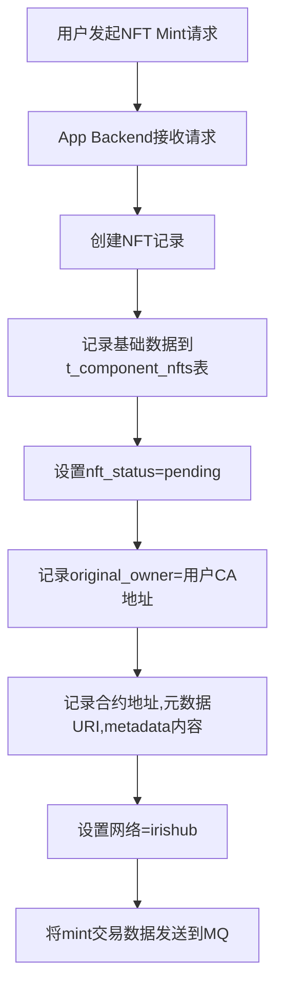

```mermaid

graph TD
    A[用户发起NFT Mint请求] --> B[App Backend接收请求]
    B --> C[创建NFT记录]
    C --> D[记录基础数据到t_component_nfts表]
    D --> E[设置nft_status=pending]
    E --> F[记录original_owner=用户CA地址]
    F --> G[记录合约地址,元数据URI,metadata内容]
    G --> H[设置网络=irishub]
    H --> 将mint交易数据发送到MQ

```