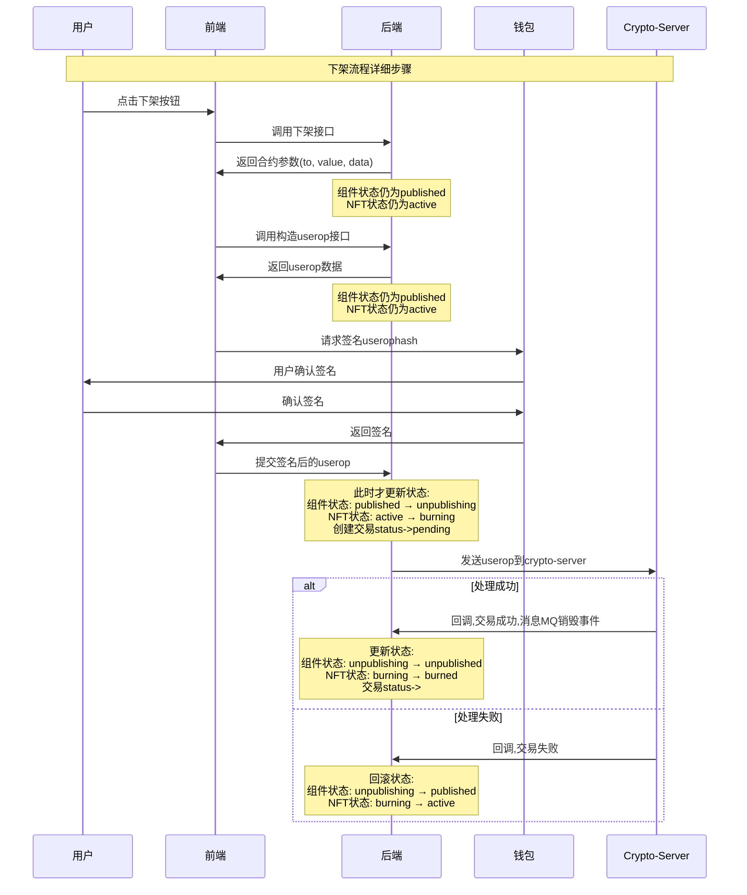

```mermaid
sequenceDiagram
    participant User as 用户
    participant Frontend as 前端
    participant Backend as 后端
    participant Wallet as 钱包
    participant CryptoServer as Crypto-Server
    
    Note over User,CryptoServer: 下架流程详细步骤
    
    User->>Frontend: 点击下架按钮
    Frontend->>Backend: 调用下架接口
    Backend->>Frontend: 返回合约参数(to, value, data)
    Note over Backend: 组件状态仍为published<br/>NFT状态仍为active
    
    Frontend->>Backend: 调用构造userop接口
    Backend->>Frontend: 返回userop数据
    Note over Backend: 组件状态仍为published<br/>NFT状态仍为active
    
    Frontend->>Wallet: 请求签名userophash
    Wallet->>User: 用户确认签名
    User->>Wallet: 确认签名
    Wallet->>Frontend: 返回签名
    
    Frontend->>Backend: 提交签名后的userop
    Note over Backend: 此时才更新状态:<br/>组件状态: published → unpublishing<br/>NFT状态: active → burning <br/> 创建交易status->pending
    Backend->>CryptoServer: 发送userop到crypto-server
    
    alt 处理成功
        CryptoServer->>Backend: 回调,交易成功,消息MQ销毁事件
        Note over Backend: 更新状态:<br/>组件状态: unpublishing → unpublished<br/>NFT状态: burning → burned <br/> 交易status->
    else 处理失败
        CryptoServer->>Backend: 回调,交易失败
        Note over Backend: 回滚状态:<br/>组件状态: unpublishing → published<br/>NFT状态: burning → active
    end
```