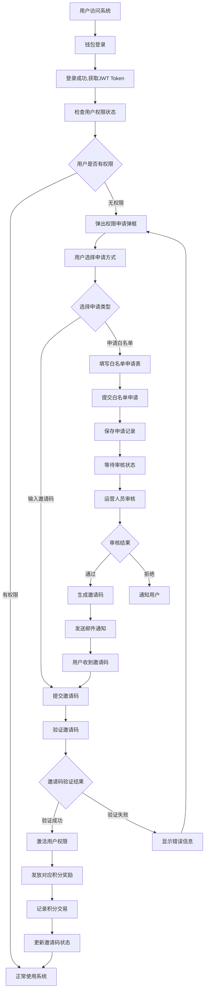

```mermaid
flowchart TD
    A[用户访问系统] --> B[钱包登录]
    B --> C[登录成功,获取JWT Token]
    C --> D[检查用户权限状态]
    D --> E{用户是否有权限}
    
    E -->|有权限| F[正常使用系统]
    E -->|无权限| G[弹出权限申请弹框]
    
    G --> H[用户选择申请方式]
    H --> I{选择申请类型}
    
    I -->|输入邀请码| J[提交邀请码]
    I -->|申请白名单| K[填写白名单申请表]
    
    J --> L[验证邀请码]
    L --> M{邀请码验证结果}
    M -->|验证成功| N[激活用户权限]
    M -->|验证失败| O[显示错误信息]
    O --> G
    
    K --> P[提交白名单申请]
    P --> Q[保存申请记录]
    Q --> R[等待审核状态]
    
    N --> S[发放对应积分奖励]
    S --> T[记录积分交易]
    T --> U[更新邀请码状态]
    U --> F
    
    R --> V[运营人员审核]
    V --> W{审核结果}
    W -->|通过| X[生成邀请码]
    W -->|拒绝| Y[通知用户]
    X --> Z[发送邮件通知]
    Z --> AA[用户收到邀请码]
    AA --> J
```