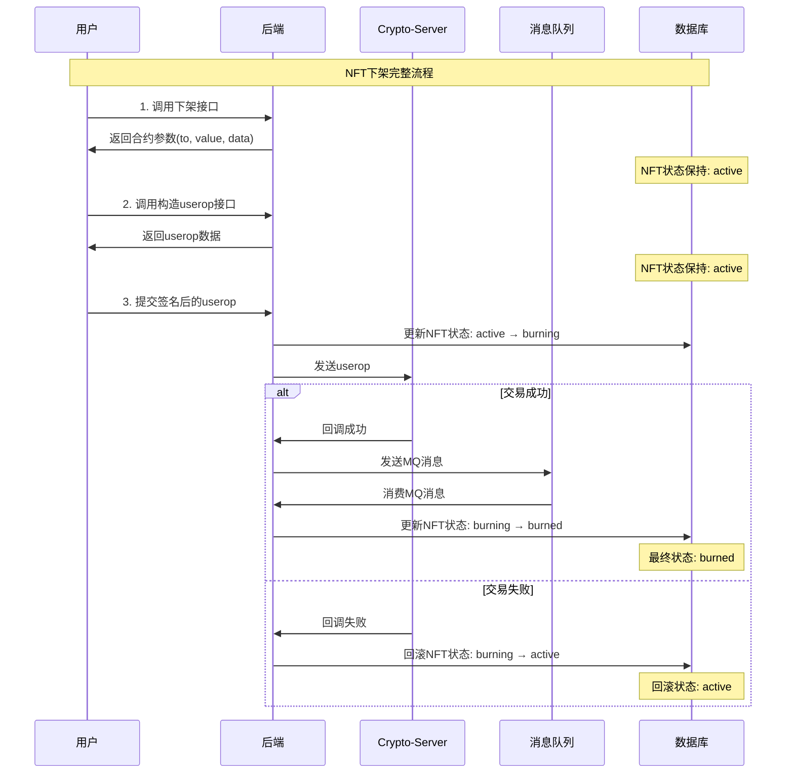

```mermaid
sequenceDiagram
    participant User as 用户
    participant Backend as 后端
    participant CryptoServer as Crypto-Server
    participant MQ as 消息队列
    participant DB as 数据库
    
    Note over User,DB: NFT下架完整流程
    
    User->>Backend: 1. 调用下架接口
    Backend->>User: 返回合约参数(to, value, data)
    Note over DB: NFT状态保持: active
    
    User->>Backend: 2. 调用构造userop接口
    Backend->>User: 返回userop数据
    Note over DB: NFT状态保持: active
    
    User->>Backend: 3. 提交签名后的userop
    Backend->>DB: 更新NFT状态: active → burning
    Backend->>CryptoServer: 发送userop
    
    alt 交易成功
        CryptoServer->>Backend: 回调成功
        Backend->>MQ: 发送MQ消息
        MQ->>Backend: 消费MQ消息
        Backend->>DB: 更新NFT状态: burning → burned
        Note over DB: 最终状态: burned
    else 交易失败
        CryptoServer->>Backend: 回调失败
        Backend->>DB: 回滚NFT状态: burning → active
        Note over DB: 回滚状态: active
    end
```