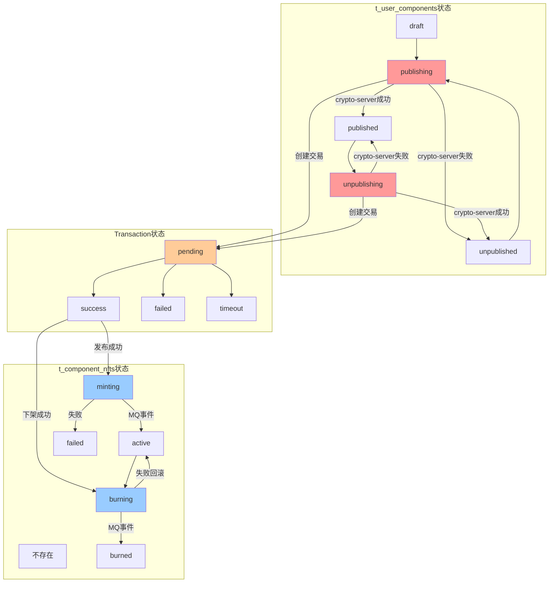

```mermaid
graph TB
    subgraph "t_user_components状态"
        UC1[draft]
        UC2[publishing]
        UC3[published]
        UC4[unpublishing]
        UC5[unpublished]
    end
    
    subgraph "t_component_nfts状态"
        NFT1[不存在]
        NFT2[minting]
        NFT3[active]
        NFT4[burning]
        NFT5[burned]
        NFT6[failed]
    end
    
    subgraph "Transaction状态"
        TX1[pending]
        TX2[success]
        TX3[failed]
        TX4[timeout]
    end
    
    UC1 --> UC2
    UC2 --> |crypto-server成功| UC3
    UC2 --> |crypto-server失败| UC5
    UC3 --> UC4
    UC4 --> |crypto-server成功| UC5
    UC4 --> |crypto-server失败| UC3
    UC5 --> UC2
    
    UC2 --> |创建交易| TX1
    UC4 --> |创建交易| TX1
    TX1 --> TX2
    TX1 --> TX3
    TX1 --> TX4
    
    TX2 --> |发布成功| NFT2
    TX2 --> |下架成功| NFT4
    NFT2 --> |MQ事件| NFT3
    NFT2 --> |失败| NFT6
    NFT3 --> NFT4
    NFT4 --> |MQ事件| NFT5
    NFT4 --> |失败回滚| NFT3
    
    style UC2 fill:#ff9999
    style UC4 fill:#ff9999
    style TX1 fill:#ffcc99
    style NFT2 fill:#99ccff
    style NFT4 fill:#99ccff
```