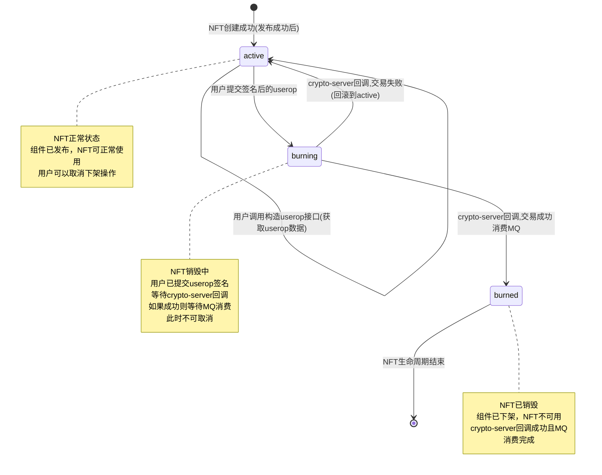

```mermaid
stateDiagram-v2
    [*] --> active: NFT创建成功(发布成功后)
    active --> active: 用户调用下架接口(获取合约参数)
    active --> active: 用户调用构造userop接口(获取userop数据)
    active --> burning: 用户提交签名后的userop
    burning --> burned: crypto-server回调,交易成功 消费MQ
    burning --> active: crypto-server回调,交易失败(回滚到active)
    
    burned --> [*]: NFT生命周期结束
    
    note right of active
        NFT正常状态
        组件已发布，NFT可正常使用
        用户可以取消下架操作
    end note
    
    note right of burning
        NFT销毁中
        用户已提交userop签名
        等待crypto-server回调
        如果成功则等待MQ消费
        此时不可取消
    end note
    
    note right of burned
        NFT已销毁
        组件已下架，NFT不可用
        crypto-server回调成功且MQ消费完成
    end note
```