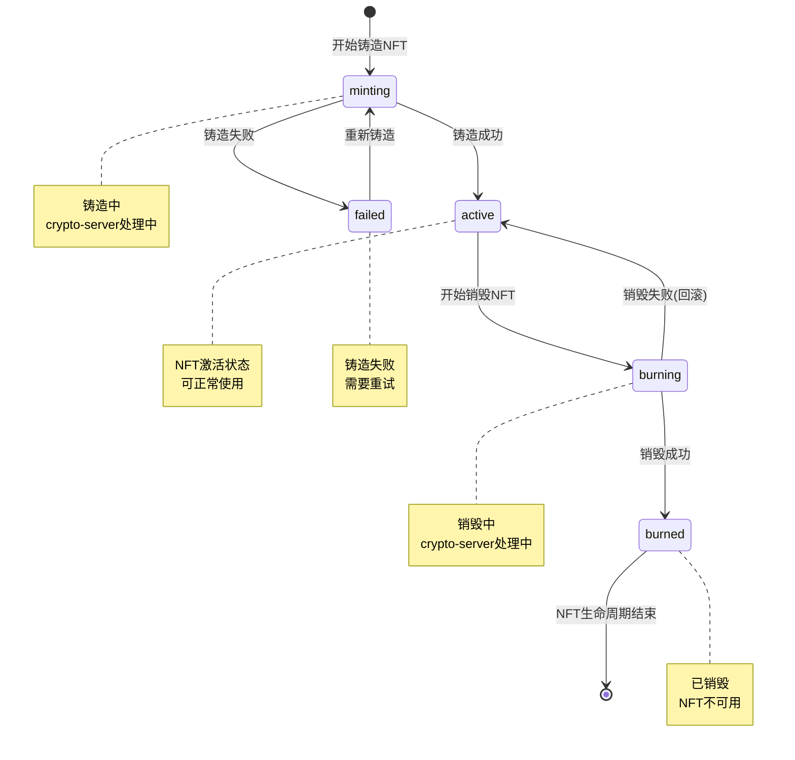

```mermaid
stateDiagram-v2
    [*] --> minting: 开始铸造NFT
    minting --> active: 铸造成功
    minting --> failed: 铸造失败
    
    active --> burning: 开始销毁NFT
    burning --> burned: 销毁成功
    burning --> active: 销毁失败(回滚)
    
    failed --> minting: 重新铸造
    burned --> [*]: NFT生命周期结束
    
    note right of minting
        铸造中
        crypto-server处理中
    end note
    
    note right of active
        NFT激活状态
        可正常使用
    end note
    
    note right of burning
        销毁中
        crypto-server处理中
    end note
    
    note right of burned
        已销毁
        NFT不可用
    end note
    
    note right of failed
        铸造失败
        需要重试
    end note
```