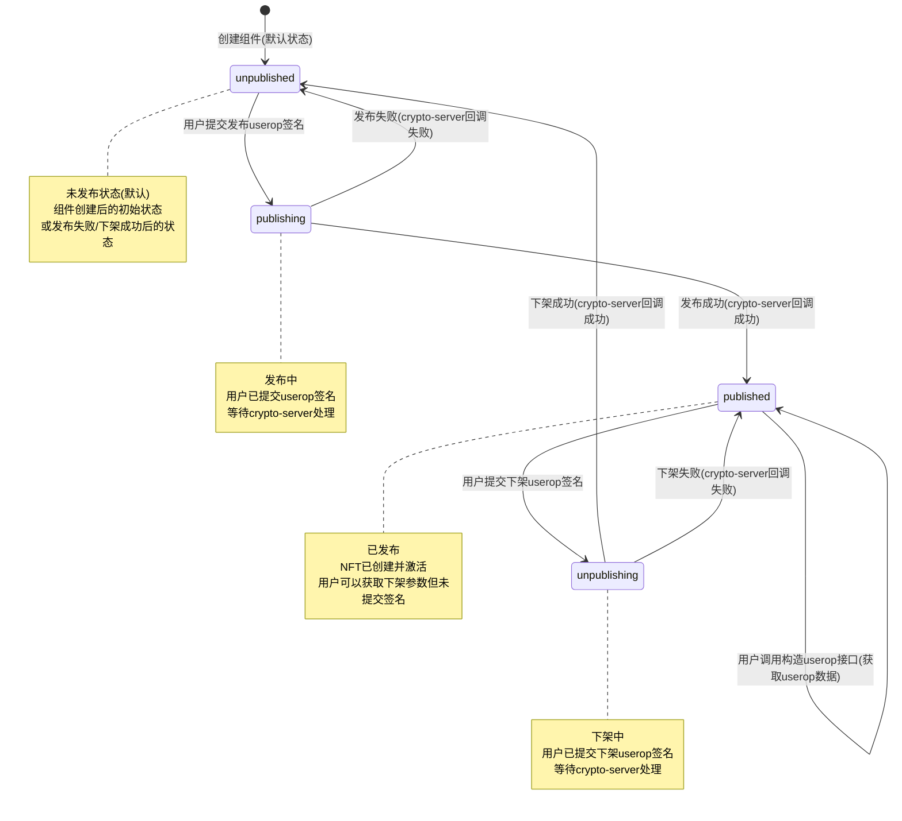

```mermaid
stateDiagram-v2
    [*] --> unpublished: 创建组件(默认状态)
    unpublished --> publishing: 用户提交发布userop签名
    publishing --> published: 发布成功(crypto-server回调成功)
    publishing --> unpublished: 发布失败(crypto-server回调失败)
    
    published --> published: 用户调用下架接口(获取合约参数)
    published --> published: 用户调用构造userop接口(获取userop数据)
    published --> unpublishing: 用户提交下架userop签名
    unpublishing --> unpublished: 下架成功(crypto-server回调成功)
    unpublishing --> published: 下架失败(crypto-server回调失败)
    
    note right of unpublished
        未发布状态(默认)
        组件创建后的初始状态
        或发布失败/下架成功后的状态
    end note
    
    note right of publishing
        发布中
        用户已提交userop签名
        等待crypto-server处理
    end note
    
    note right of published
        已发布
        NFT已创建并激活
        用户可以获取下架参数但未提交签名
    end note
    
    note right of unpublishing
        下架中
        用户已提交下架userop签名
        等待crypto-server处理
    end note
```