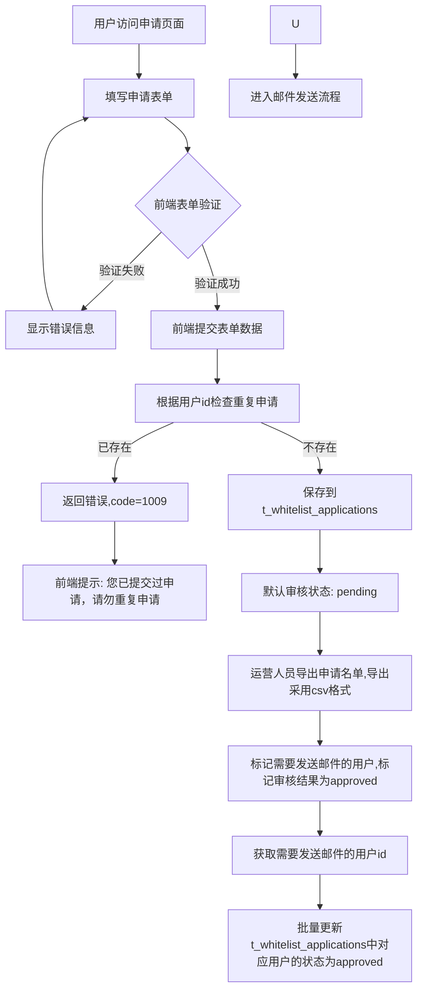

```mermaid

flowchart TD
    A[用户访问申请页面] --> B[填写申请表单]
    B --> C{前端表单验证}
    C -->|验证失败| D[显示错误信息]
    D --> B
    C -->|验证成功| E[前端提交表单数据]
    E --> F[根据用户id检查重复申请]
    F -->|已存在| G[返回错误,code=1009]
    G --> H[前端提示: 您已提交过申请，请勿重复申请]
    F -->|不存在| I[保存到t_whitelist_applications]
    I --> K[默认审核状态: pending]
    
    K --> P[运营人员导出申请名单,导出采用csv格式]
    P --> S[标记需要发送邮件的用户,标记审核结果为approved]
    S --> T1[获取需要发送邮件的用户id]
    T1--> T2[批量更新t_whitelist_applications中对应用户的状态为approved]
    U --> V[进入邮件发送流程]

```