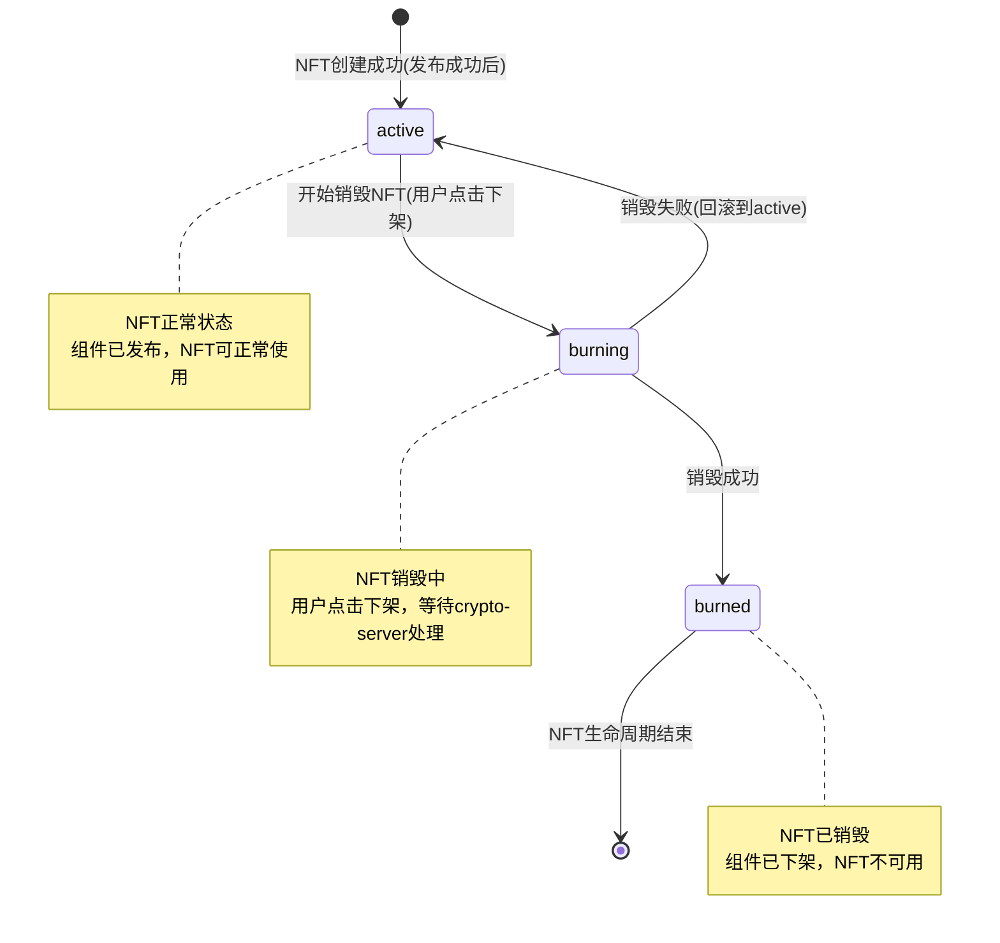

```mermaid
stateDiagram-v2
    [*] --> active: NFT创建成功(发布成功后)
    active --> burning: 开始销毁NFT(用户点击下架)
    burning --> burned: 销毁成功
    burning --> active: 销毁失败(回滚到active)
    
    burned --> [*]: NFT生命周期结束
    
    note right of active
        NFT正常状态
        组件已发布，NFT可正常使用
    end note
    
    note right of burning
        NFT销毁中
        用户点击下架，等待crypto-server处理
    end note
    
    note right of burned
        NFT已销毁
        组件已下架，NFT不可用
    end note
```