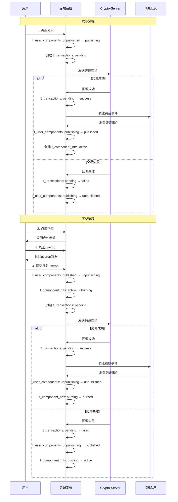

```mermaid
sequenceDiagram
    participant User as 用户
    participant Backend as 后端系统
    participant CryptoServer as Crypto-Server
    participant MQ as 消息队列
    
    Note over User,MQ: 发布流程
    User->>Backend: 1. 点击发布
    Backend->>Backend: t_user_components: unpublished → publishing
    Backend->>Backend: 创建 t_transactions: pending
    Backend->>CryptoServer: 发送铸造交易
    
    alt 交易成功
        CryptoServer->>Backend: 回调成功
        Backend->>Backend: t_transactions: pending → success
        Backend->>MQ: 发送铸造事件
        MQ->>Backend: 消费铸造事件
        Backend->>Backend: t_user_components: publishing → published
        Backend->>Backend: 创建 t_component_nfts: active
    else 交易失败
        CryptoServer->>Backend: 回调失败
        Backend->>Backend: t_transactions: pending → failed
        Backend->>Backend: t_user_components: publishing → unpublished
    end
    
    Note over User,MQ: 下架流程
    User->>Backend: 2. 点击下架
    Backend->>User: 返回合约参数
    User->>Backend: 3. 构造userop
    Backend->>User: 返回userop数据
    User->>Backend: 4. 提交签名userop
    Backend->>Backend: t_user_components: published → unpublishing
    Backend->>Backend: t_component_nfts: active → burning
    Backend->>Backend: 创建 t_transactions: pending
    Backend->>CryptoServer: 发送销毁交易
    
    alt 交易成功
        CryptoServer->>Backend: 回调成功
        Backend->>Backend: t_transactions: pending → success
        Backend->>MQ: 发送销毁事件
        MQ->>Backend: 消费销毁事件
        Backend->>Backend: t_user_components: unpublishing → unpublished
        Backend->>Backend: t_component_nfts: burning → burned
    else 交易失败
        CryptoServer->>Backend: 回调失败
        Backend->>Backend: t_transactions: pending → failed
        Backend->>Backend: t_user_components: unpublishing → published
        Backend->>Backend: t_component_nfts: burning → active
    end
```