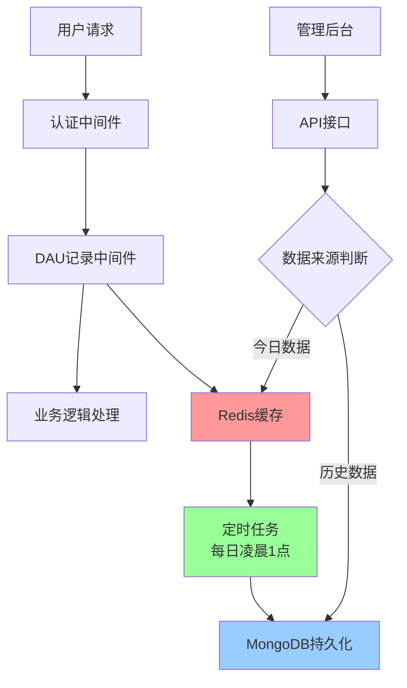

```mermaid
graph TB
    A[用户请求] --> B[认证中间件]
    B --> C[DAU记录中间件]
    C --> D[业务逻辑处理]
    C --> E[Redis缓存]
    
    E --> F[定时任务<br/>每日凌晨1点]
    F --> G[MongoDB持久化]
    
    H[管理后台] --> I[API接口]
    I --> J{数据来源判断}
    J -->|今日数据| E
    J -->|历史数据| G
    
    style E fill:#ff9999
    style G fill:#99ccff
    style F fill:#99ff99
```