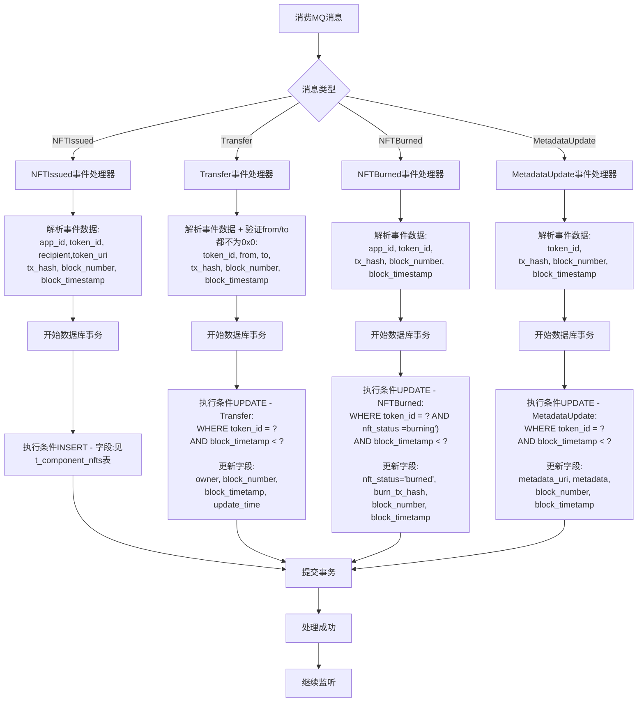

```mermaid

flowchart TD
    A[消费MQ消息] --> B{消息类型}
    
    %% 四种事件类型
    B -->|NFTIssued| C[NFTIssued事件处理器]
    B -->|Transfer| D[Transfer事件处理器]
    B -->|NFTBurned| E[NFTBurned事件处理器]
    B -->|MetadataUpdate| F[MetadataUpdate事件处理器]
    
    %% 解析事件数据
    C --> G["解析事件数据:<br/>app_id, token_id, recipient,token_uri<br/>tx_hash, block_number, block_timestamp"]
    D --> H["解析事件数据 + 验证from/to都不为0x0:<br/>token_id, from, to,<br/>tx_hash, block_number, block_timestamp"]
    E --> I["解析事件数据:<br/>app_id, token_id,<br/>tx_hash, block_number, block_timestamp"]
    F --> J["解析事件数据:<br/>token_id,<br/>tx_hash, block_number, block_timestamp"]
    
    G --> K[开始数据库事务]
    H --> L[开始数据库事务]
    I --> M[开始数据库事务]
    J --> N[开始数据库事务]
    
    K --> O["执行条件INSERT - 字段:见t_component_nfts表"]
    
    L --> P["执行条件UPDATE - Transfer:<br/>WHERE token_id = ?<br/>AND block_timetamp < ?<br/><br/>更新字段:<br/>owner, block_number,<br/>block_timetamp, update_time"]
    
    M --> Q["执行条件UPDATE - NFTBurned:<br/>WHERE token_id = ? AND nft_status =burning')<br/>AND block_timetamp < ?<br/><br/>更新字段:<br/>nft_status='burned', burn_tx_hash,<br/>block_number, block_timetamp"]
    
    N --> R["执行条件UPDATE - MetadataUpdate:<br/>WHERE token_id = ?<br/>AND block_timetamp < ?<br/><br/>更新字段:<br/>metadata_uri, metadata,<br/>block_number, block_timetamp"]
    
    O --> V[提交事务]
    P --> V
    Q --> V
    R --> V
    
    V --> X[处理成功]
    
    X --> Z[继续监听]

```