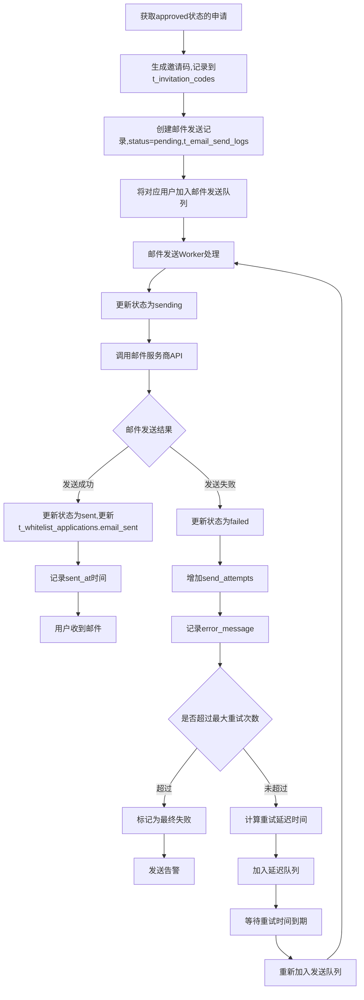

```mermaid

flowchart TD
    A[获取approved状态的申请] --> B[生成邀请码,记录到t_invitation_codes]
    B --> C[创建邮件发送记录,status=pending,t_email_send_logs]
    C --> D[将对应用户加入邮件发送队列]
    
    D --> E[邮件发送Worker处理]
    E --> F[更新状态为sending]
    F --> G[调用邮件服务商API]
    G --> H{邮件发送结果}
    
    H -->|发送成功| I[更新状态为sent,更新t_whitelist_applications.email_sent]
    I --> J[记录sent_at时间]
    J --> K[用户收到邮件]
    
    H -->|发送失败| L[更新状态为failed]
    L --> M[增加send_attempts]
    M --> N[记录error_message]
    N --> O{是否超过最大重试次数}
    O -->|超过| P[标记为最终失败]
    P --> Q[发送告警]
    O -->|未超过| R[计算重试延迟时间]
    R --> S[加入延迟队列]
    S --> T[等待重试时间到期]
    T --> U[重新加入发送队列]
    U --> E

```