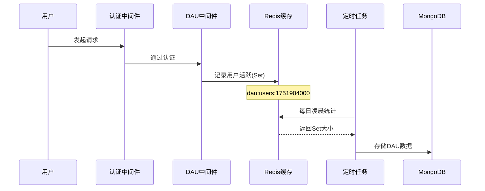

```mermaid
sequenceDiagram
    participant User as 用户
    participant Auth as 认证中间件
    participant DAU as DAU中间件
    participant Redis as Redis缓存
    participant Task as 定时任务
    participant DB as MongoDB
    
    User->>Auth: 发起请求
    Auth->>DAU: 通过认证
    DAU->>Redis: 记录用户活跃(Set)
    Note over Redis: dau:users:1751904000
    
    Task->>Redis: 每日凌晨统计
    Redis-->>Task: 返回Set大小
    Task->>DB: 存储DAU数据
   
```