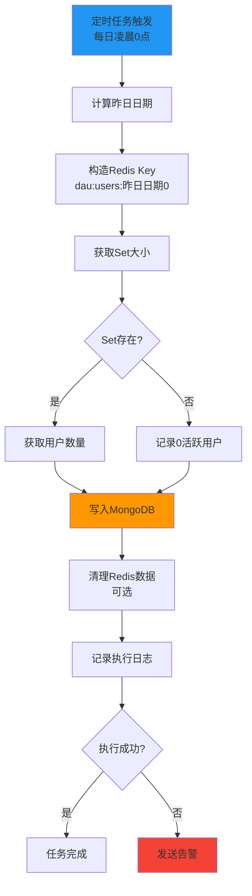

```mermaid
flowchart TD
    A[定时任务触发<br/>每日凌晨0点] --> B[计算昨日日期]
    B --> C[构造Redis Key<br/>dau:users:昨日日期0]
    C --> D[获取Set大小]
    D --> E{Set存在?}
    E -->|否| F[记录0活跃用户]
    E -->|是| G[获取用户数量]
    G --> H[写入MongoDB]
    F --> H
    H --> I[清理Redis数据<br/>可选]
    I --> J[记录执行日志]
    J --> K{执行成功?}
    K -->|是| L[任务完成]
    K -->|否| M[发送告警]
    
    style A fill:#2196f3
    style H fill:#ff9800
    style M fill:#f44336
```