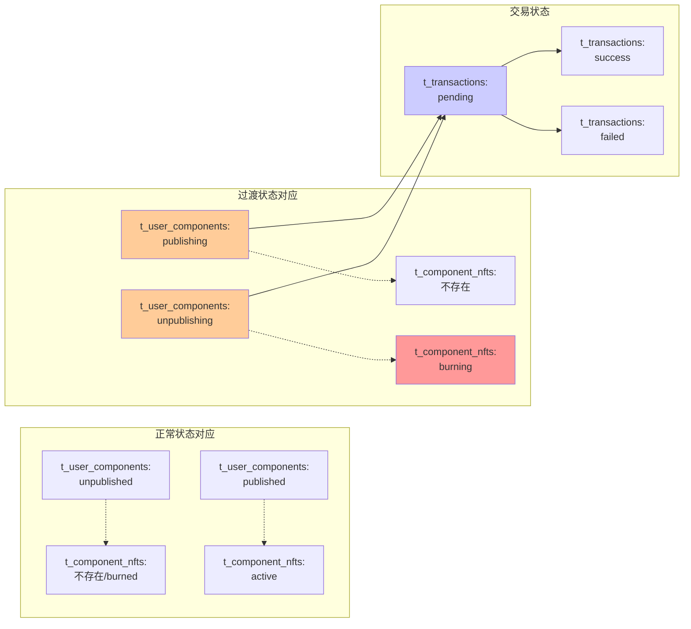

```mermaid
graph LR
    subgraph "正常状态对应"
        A1[t_user_components:<br/>unpublished] -.-> B1[t_component_nfts:<br/>不存在/burned]
        A2[t_user_components:<br/>published] -.-> B2[t_component_nfts:<br/>active]
    end
    
    subgraph "过渡状态对应"
        A3[t_user_components:<br/>publishing] -.-> B3[t_component_nfts:<br/>不存在]
        A4[t_user_components:<br/>unpublishing] -.-> B4[t_component_nfts:<br/>burning]
    end
    
    subgraph "交易状态"
        C1[t_transactions:<br/>pending]
        C2[t_transactions:<br/>success]
        C3[t_transactions:<br/>failed]
    end
    
    A3 --> C1
    A4 --> C1
    C1 --> C2
    C1 --> C3
    
    style A3 fill:#ffcc99
    style A4 fill:#ffcc99
    style B4 fill:#ff9999
    style C1 fill:#ccccff
```