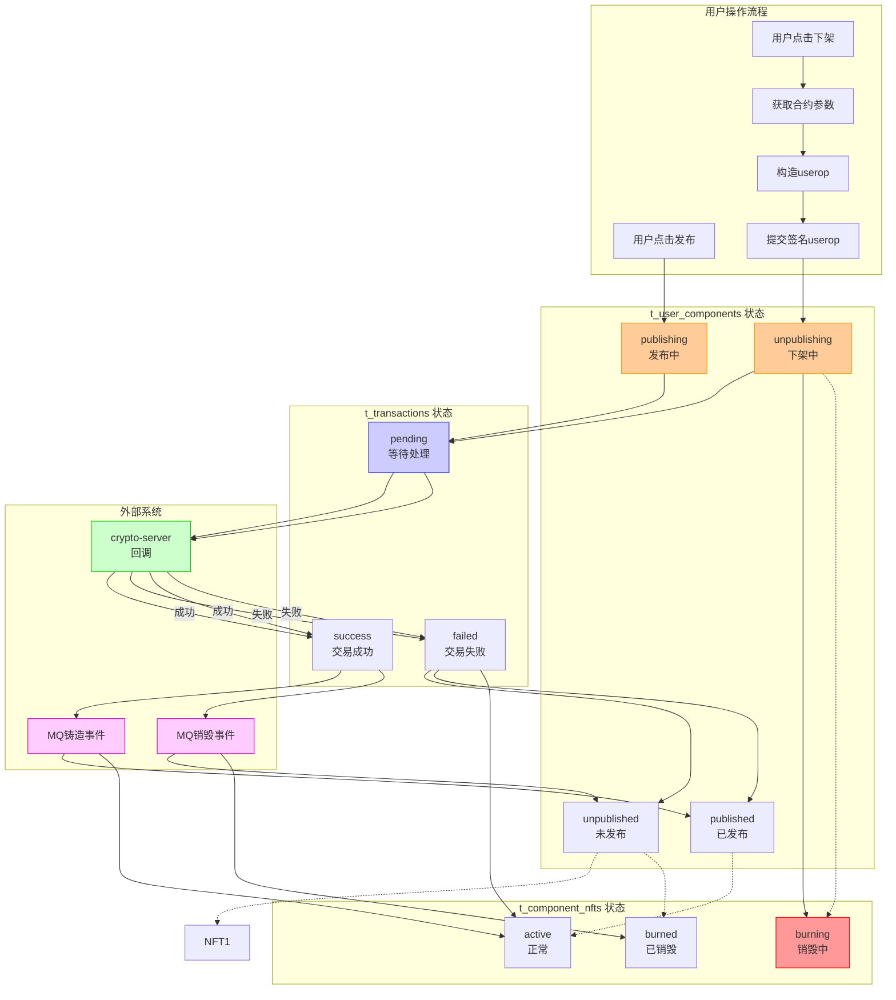

```mermaid
graph TB
    subgraph "用户操作流程"
        U1[用户点击发布]
        U2[用户点击下架]
        U3[获取合约参数]
        U4[构造userop]
        U5[提交签名userop]
    end
    
    subgraph "t_user_components 状态"
        UC1[unpublished<br/>未发布]
        UC2[publishing<br/>发布中]
        UC3[published<br/>已发布]
        UC4[unpublishing<br/>下架中]
    end
    
    subgraph "t_component_nfts 状态"
        
        NFT2[active<br/>正常]
        NFT3[burning<br/>销毁中]
        NFT4[burned<br/>已销毁]
    end
    
    subgraph "t_transactions 状态"
        TX1[pending<br/>等待处理]
        TX2[success<br/>交易成功]
        TX3[failed<br/>交易失败]
    end
    
    subgraph "外部系统"
        CS[crypto-server<br/>回调]
        MQ1[MQ铸造事件]
        MQ2[MQ销毁事件]
    end
    
    %% 发布流程
    U1 --> UC2
    UC2 --> TX1
    TX1 --> CS
    CS --> |成功| TX2
    CS --> |失败| TX3
    TX2 --> MQ1
    MQ1 --> UC3
    MQ1 --> NFT2
    TX3 --> UC1
    
    %% 下架流程
    U2 --> U3
    U3 --> U4
    U4 --> U5
    U5 --> UC4
    UC4 --> TX1
    UC4 --> NFT3
    TX1 --> CS
    CS --> |成功| TX2
    CS --> |失败| TX3
    TX2 --> MQ2
    MQ2 --> UC1
    MQ2 --> NFT4
    TX3 --> UC3
    TX3 --> NFT2
    
    %% 状态对应关系
    UC1 -.-> NFT1
    UC3 -.-> NFT2
    UC4 -.-> NFT3
    UC1 -.-> NFT4
    
    %% 样式
    style UC2 fill:#ffcc99,stroke:#ff9900
    style UC4 fill:#ffcc99,stroke:#ff9900
    style NFT3 fill:#ff9999,stroke:#ff0000
    style TX1 fill:#ccccff,stroke:#0000ff
    style CS fill:#ccffcc,stroke:#00cc00
    style MQ1 fill:#ffccff,stroke:#cc00cc
    style MQ2 fill:#ffccff,stroke:#cc00cc
```