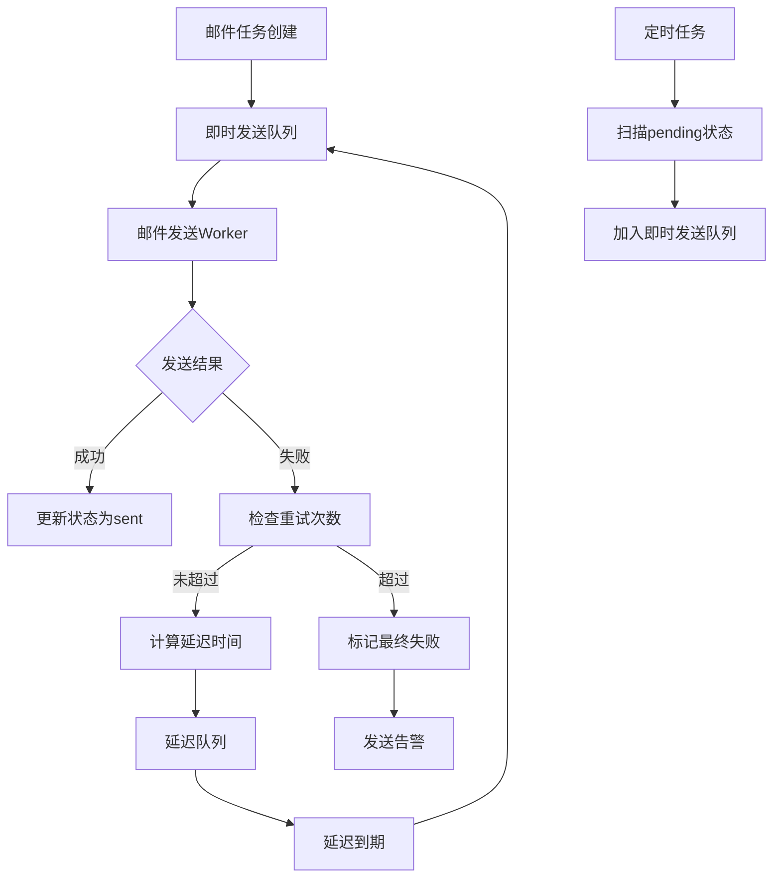

```mermaid
graph TD
    A[邮件任务创建] --> B[即时发送队列]
    B --> C[邮件发送Worker]
    C --> D{发送结果}
    
    D -->|成功| E[更新状态为sent]
    D -->|失败| F[检查重试次数]
    
    F -->|未超过| G[计算延迟时间]
    G --> H[延迟队列]
    H --> I[延迟到期]
    I --> B
    
    F -->|超过| J[标记最终失败]
    J --> K[发送告警]
    
    L[定时任务] --> M[扫描pending状态]
    M --> N[加入即时发送队列]
```