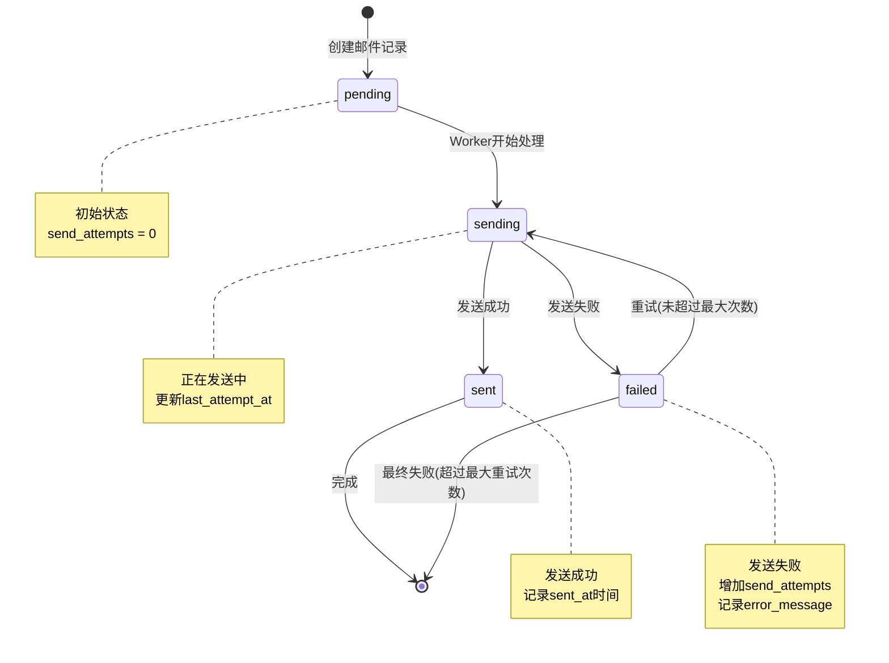

```mermaid

stateDiagram-v2
    [*] --> pending: 创建邮件记录
    pending --> sending: Worker开始处理
    sending --> sent: 发送成功
    sending --> failed: 发送失败
    sent --> [*]: 完成
    failed --> sending: 重试(未超过最大次数)
    failed --> [*]: 最终失败(超过最大重试次数)
    
    note right of pending
        初始状态
        send_attempts = 0
    end note
    
    note right of sending
        正在发送中
        更新last_attempt_at
    end note
    
    note right of sent
        发送成功
        记录sent_at时间
    end note
    
    note right of failed
        发送失败
        增加send_attempts
        记录error_message
    end note

```