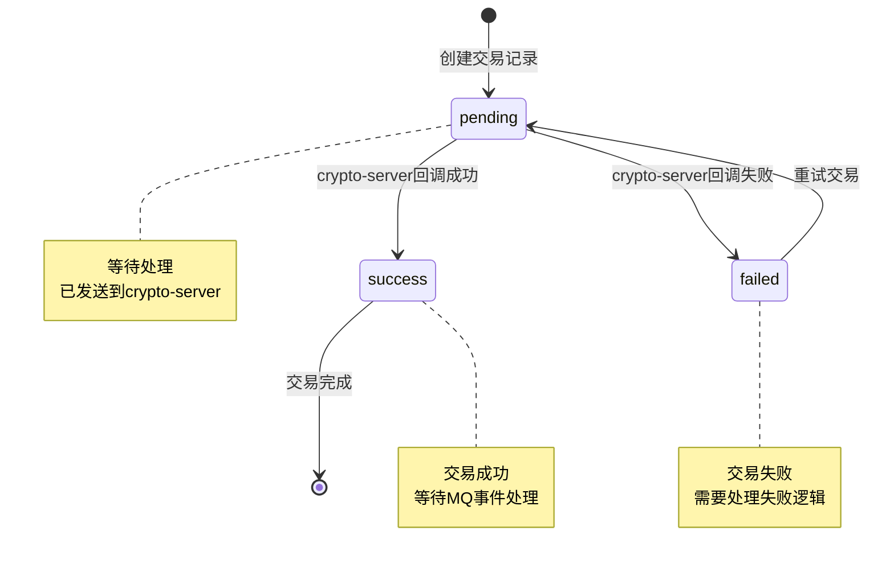

```mermaid
stateDiagram-v2
    [*] --> pending: 创建交易记录
    pending --> success: crypto-server回调成功
    pending --> failed: crypto-server回调失败
    
    failed --> pending: 重试交易
    
    success --> [*]: 交易完成
    
    note right of pending
        等待处理
        已发送到crypto-server
    end note
    
    note right of success
        交易成功
        等待MQ事件处理
    end note
    
    note right of failed
        交易失败
        需要处理失败逻辑
    end note
    
   
```