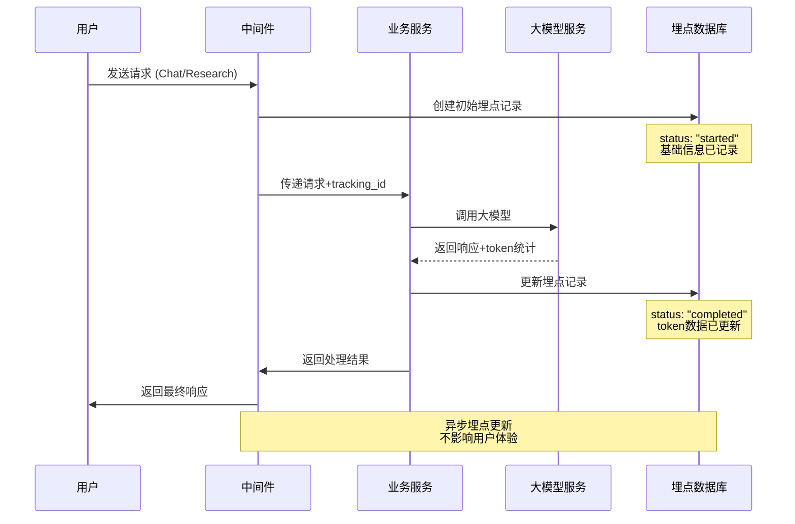

```mermaid
sequenceDiagram
    participant U as 用户
    participant M as 中间件
    participant S as 业务服务
    participant L as 大模型服务
    participant DB as 埋点数据库
    
    U->>M: 发送请求 (Chat/Research)
    M->>DB: 创建初始埋点记录
    Note over DB: status: "started"<br/>基础信息已记录
    M->>S: 传递请求+tracking_id
    
    S->>L: 调用大模型
    L-->>S: 返回响应+token统计
    S->>DB: 更新埋点记录
    Note over DB: status: "completed"<br/>token数据已更新
    
    S->>M: 返回处理结果
    M->>U: 返回最终响应
    
    Note over M,DB: 异步埋点更新<br/>不影响用户体验
```