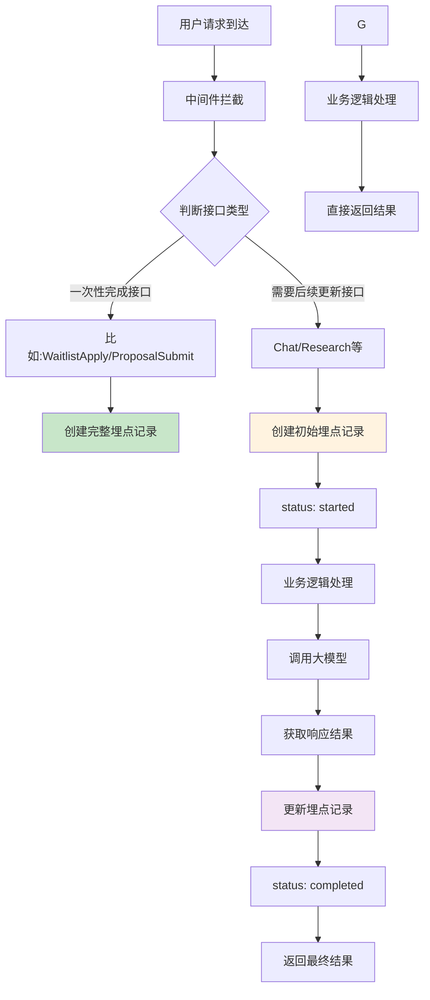

```mermaid
flowchart TD
    A[用户请求到达] --> B[中间件拦截]
    B --> C{判断接口类型}
    
    C -->|一次性完成接口| D[比如:WaitlistApply/ProposalSubmit]
    C -->|需要后续更新接口| E[Chat/Research等]
    
    D --> F[创建完整埋点记录]
    G --> H[业务逻辑处理]
    H --> I[直接返回结果]
    
    E --> J[创建初始埋点记录]
    J --> K[status: started]
    K --> L[业务逻辑处理]
    L --> M[调用大模型]
    M --> N[获取响应结果]
    N --> O[更新埋点记录]
    O --> P[status: completed]
    P --> Q[返回最终结果]
    
    style F fill:#c8e6c9
    style J fill:#fff3e0
    style O fill:#f3e5f5
```