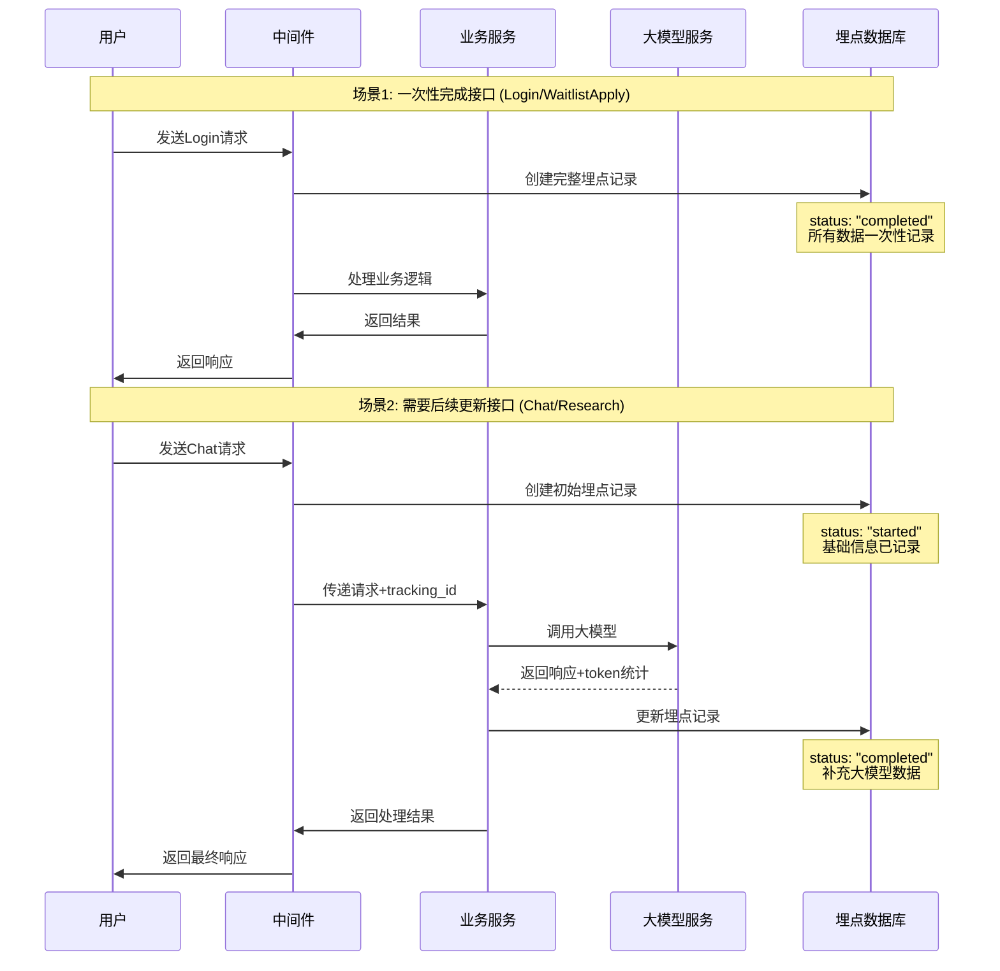

```mermaid
sequenceDiagram
    participant U as 用户
    participant M as 中间件
    participant S as 业务服务
    participant L as 大模型服务
    participant DB as 埋点数据库
    
    Note over U,DB: 场景1: 一次性完成接口 (Login/WaitlistApply)
    U->>M: 发送Login请求
    M->>DB: 创建完整埋点记录
    Note over DB: status: "completed"<br/>所有数据一次性记录
    M->>S: 处理业务逻辑
    S->>M: 返回结果
    M->>U: 返回响应
    
    Note over U,DB: 场景2: 需要后续更新接口 (Chat/Research)
    U->>M: 发送Chat请求
    M->>DB: 创建初始埋点记录
    Note over DB: status: "started"<br/>基础信息已记录
    M->>S: 传递请求+tracking_id
    S->>L: 调用大模型
    L-->>S: 返回响应+token统计
    S->>DB: 更新埋点记录
    Note over DB: status: "completed"<br/>补充大模型数据
    S->>M: 返回处理结果
    M->>U: 返回最终响应
```